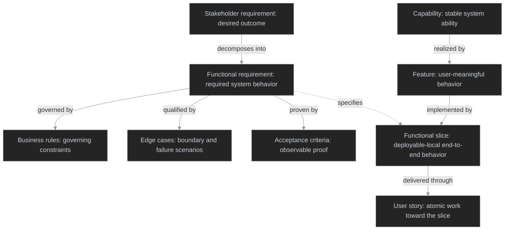

# Leading words
<!--
 **Leading Word**- A compact concept — also called a _Leitwort_ — already living in the model's pretraining, that the agent thinks with while running the skill. It encodes a behavioural principle in the fewest possible tokens by invoking priors the model already holds (e.g. _lesson_, _proximal zone of development_, _fog of war_, _tracer bullets_). Repeated as a token, never as a sentence, it accumulates a distributed definition across the skill and anchors a whole region of behaviour. Coining your own works if you define it clearly, but a made-up word recruits no priors — you pay in definition tokens what a pretrained word gives free. Reach for an existing word first.

A leading word serves **predictability** twice. In the body it anchors **execution** — the agent reaches for the same behaviour every time the concept appears, and inside flat reference it focuses attention on a class of thing to look for, recruiting the right checks each run. In the **description** it anchors **invocation** — and not only within the skill: when the same word lives in your prompts, your docs, and your codebase, the agent links that shared language to the skill and fires it more reliably. Word a description with the leading words you actually use when you want the skill.
-->

**Facet**
one particular aspect, side, or feature of something.

**Fact**:
Information discoverable by exploring the codebase (validation rules, constraints, domain concepts, data models, contracts, schemas, relationships, business logic) — looked up directly during grilling, never asked of the user.
_Avoid_: assumption, guess
_Plugins_set_: wf

**Decision**:
A resolved choice that is the user's call, not derivable from the codebase — put to the user during grilling and captured only once they confirm it.
_Avoid_: fact, assumption
_Plugins_set_: wf

**Seam**:
A place in the codebase where a test can observe or alter behavior without changing the code at that point. Existing seams are preferred over new ones, and the highest seam through which a feature can still be verified is preferred over a lower one — the fewer seams a change introduces, the better.
_Avoid_: test point, hook, injection point
_Plugins_set_: wf

**Prior art**:
Existing tests in the codebase of the same type as the ones being planned for a change — surfaced and followed as the pattern for new tests instead of inventing a new testing style.
_Avoid_: existing tests, precedent
_Plugins_set_: wf

**Verbatim**:
Copied exactly as written, with no paraphrasing, summarizing, or restructuring — used to mark content (a template, a settings block) that must be reproduced word-for-word rather than reinterpreted.
_Avoid_: as-is, unmodified
_Plugins_set_: wf

**Flywheel**:
A self-reinforcing cycle in which each turn closes a gap in the source, producing better outputs that in turn close further gaps — improvement compounds automatically rather than depending on external intervention.

# Contexts
## Shared

Location: plugins/

Terms used across more than one plugin — not owned by a single plugin's context.

### Language
**Harness environment**:
The repository that owns the milestone/issues and hosts the docs. Separate from the **Codebase Repo Path** when a **Harness Repo Path**/workspace folder exists; otherwise the two are the same.
**Harness Repo Path**:
The repository that owns the milestone/issues and hosts the repo-local development workflow, resolved once by the entry-point skill (`resolve-harness`/`init-harness`) and passed explicitly downstream rather than re-derived by each component. Distinct from the `Codebase Repo Path` and `Worktree Path`, though one repository can serve all three roles.
_Avoid_: repo root, home repo, harness root
_Plugins_set_: ralph, crew, wf

**Codebase Repo Path**:
The Git repository containing the source code Ralph develops, resolved once alongside the `Harness Repo Path` by the entry-point skill and supplied explicitly to `/create-worktree`. Distinct from the `Harness Repo Path` and `Worktree Path`, though it can also be the Harness Repo Path.
_Avoid_: codebase, source checkout, source repository
_Plugins_set_: ralph, wf

**Worktree Path**:
The git worktree Ralph uses for code, Git, build, test, and PR operations. Ralph launches the crew agents from it when applicable; each agent treats its invocation directory as its workspace and does not receive this path.
_Avoid_: working directory, checkout
_Plugins_set_: ralph, crew, wf

**Ledger**:
A session-scoped record, persisted via the memory tool at `/memories/session/domain-model-ledger.md`, of every Concept/ADR/service doc opened so far in the session — one line per record, checked before discussing any module, boundary, or service to avoid re-opening or re-scanning the index.
_Avoid_: log, history
_Plugins_set_: wf

**Trigger Indexer**:
The mechanism that owns an index table end to end — abstract over any table with a Trigger condition column (Services, ADRs, Concepts, or custom tables): generates concise, domain-specific phrases natural to grilling, keeps caller-supplied row cells in sync on add/supersede/retire, and semantically matches clauses against the current change's touched surface and grilling context before opening linked records. Blank Trigger condition cells never match, and columns the caller did not name are preserved.
_Avoid_: local RAG, index scanner, retrieval index
_Plugins_set_: wf

## ralph
### Language

## crew
### Language

**Codey**:
The implementation agent. Implements one task in its invocation directory and returns the five-field report that alone governs `ralph:dev`'s distill, commit, and issue-handling steps.
_Avoid_: droid, implementer, coder

**Chorey**:
The maintainability-review agent. Reviews the change set for behavior-preserving refactors — Codey's checkpoint commit (named by a trusted `BASELINE_COMMIT`) inside the loop, or uncommitted work standalone — runs only behind a Codey `STATUS: complete` gate, reports informationally, and discards its own refactors (git-native revert against the checkpoint, or a manual snapshot standalone) when its verification cannot pass.
_Avoid_: reviewer, refactorer, cleanup agent

**Stack**:
A technology family a repo's code belongs to — `py`, `dotnet`, `ai` — named by the `codey-<stack>` agent that ships for it and used as the suffix on the per-repo files it owns (`CODE-<stack>.md`, `VERIFY-<stack>.md`, `CHORE-<stack>.md`). The vocabulary is closed: a stack exists only where an agent ships for it, so a repo never declares one nothing would read. One repo can carry several.
_Avoid_: language, platform, toolchain, tech

**Stack agent**:
A delta agent for one Stack — frontmatter, a declared scope, and only the phases it overrides, invoking a Flow skill for everything else. Carries stack-level knowledge that holds in any repo, never one repo's paths, commands, or layout.
_Avoid_: language agent, specialised codey, subclass agent

**Flow skill**:
The skill holding a family of agents' shared workflow — `crew-codey-flow` for `codey` and every Stack agent, `crew-chorey-flow` for `chorey`. Reached by name, which is why no agent file ever points at another agent file.
_Avoid_: base agent, parent agent, agent template

**Convention folder**:
The per-repo `.crew/` directory under the `Harness Repo Path` holding the shared `GOTCHAS.md` plus a `CODE-<stack>.md`, `VERIFY-<stack>.md`, and `CHORE-<stack>.md` per installed Stack — the single location a crew agent resolves them from, never discovered or searched for. An unsuffixed filename means shared across every Stack; a missing suffixed file is absent, never a reason to read the unsuffixed one.
_Avoid_: .droid, config folder, settings directory

**Gotchas**:
Reusable directives stored with the `crew-gotchas` skill. Read and applied before implementation; after feedback loops pass, the agent distills session friction (convention conflicts, directory/tool access issues) into new directives or extensions of existing ones and writes them back directly — no human curation step.
_Avoid_: decisions, durable decisions, problem log

**Module**:
The unit of code plus its build config, identified by walking up from a changed file to the nearest build-config marker — the walk-up rule is written in the Stack's own `VERIFY-<stack>.md`, in that Stack's vocabulary, never assumed or named by a skill.
_Avoid_: project, package

**Verification counterpart**:
The sibling/child unit that verifies a Module (tests, specs, or whatever the repo calls it), mapped by the same `VERIFY-<stack>.md` that defines its Module. Absent a `VERIFY` file, `crew-feedback` discovers the toolchain from the repo's README and runs it unscoped rather than deriving counterparts itself.
_Avoid_: test project, test suite

## wf

### Language

Arrows express relationship direction, not cardinality; the definitions below state the allowed cardinality.

**Deployable**:
An independently runnable or deployed production unit, such as a process, service, container, function, host workload, or scheduled job.

**Capability**:
A stable, coarse-grained system ability. A Capability may be realized by multiple Features, and a Feature may contribute to multiple Capabilities.

**Feature**:
A user-meaningful product behavior that delivers all or part of a Capability. A Feature may comprise multiple Functional slices and is complete only when its required Functional slices are complete.

**Functional slice**:
A deployable-local, end-to-end implementation of a distinct system behavior or outcome.
Its boundaries follow functional responsibility rather than technical layers.
It belongs to one deployable; a cross-deployable flow connects Functional slices through their contracts.
Its test seams are the observable inputs and outputs where the slice can be tested independently.

**User story**:
An atomic, testable unit of planned work that advances one Functional slice and traces to the Functional requirements and Acceptance criteria it addresses. A Functional slice may require multiple User stories.

**Stakeholder requirement**:
States the desired outcome: *An administrator can control session lifetime.*
**Functional requirement**: 
States the required system behavior: *The system lets an administrator configure session lifetime.*
**Business rule**: 
States the governing constraint: *Session lifetime must be from one hour through 30 days.*
**Edge case**: 
States a boundary, unusual, failure, or exceptional scenario: *A configured session lifetime is zero, absent, expired, or changes while sessions are active.*
**Acceptance criterion**:
States observable proof: *When the administrator configures a session lifetime of zero, the system rejects it and explains the validation failure.*

**Requirement set**:
One Stakeholder requirement together with its Functional requirements, Business rules, Edge cases, and Acceptance criteria.

**Specification (Spec)**:
An artifact that packages one or more Requirement sets for planning and handoff. A Spec is not a level in the behavior hierarchy.

**Initiative**:
A coordinated product change tracked as one planning effort. An Initiative may encompass multiple Capabilities, Features, Specs, and one Feature design.
_Avoid_: feature when referring to the whole planning effort

**Initiative slug**:
A stable, filesystem-safe kebab-case identifier for an Initiative, used in artifact paths.
_Avoid_: feature slug, Initiative tag

**Initiative tag**:
An optional SCREAMING_SNAKE_CASE label that groups User stories under an Initiative without changing their Functional-slice scope.
_Avoid_: feature tag, Initiative slug

**Feature design**:
The authoritative solution design for one Initiative, potentially covering multiple Capabilities, Features, and Functional slices.

**Use case**:
An actor-oriented description of one goal within a Feature, including preconditions, a main flow, alternate flows, and postconditions. A Feature may have multiple Use cases.

**Tracer-bullet ticket**:
An agent-executable planning unit that delivers a narrow, complete, verifiable path through every integration layer needed for one behavior. It may implement part or all of one Functional slice but is not itself a Functional slice.
_Avoid_: slice, vertical slice

**Inspect**:
Look at something directly and record what is there.
_Typical question_: “What does this code/config/system contain?”
_Typical output_: Facts, inventory, observations.

**Analyze**:
Break something down and explain its structure, behavior, relationships, or impact.
_Typical question_: “How does this work, and what does it imply?”
_Typical output_: Model, explanation, dependencies, findings.

**Investigate**:
Follow evidence to resolve a specific uncertainty, problem, or question.
_Typical question_: “Why is this happening?” / “Where is this implemented?”
_Typical output_: Conclusion backed by evidence, root cause, answer.

**Research**:
Gather knowledge from multiple sources to understand a topic or support a decision.
_Typical question_: “What do we need to know about X?”
_Typical output_: Consolidated knowledge, options, constraints, citations.

**Completeness sweep**:
A closing check, run before concluding a session that opened at least one full Concept/ADR record, that outputs one disposition line (`Applied`, `Not applicable`, `Violated`, or `Superseded`) per row in `ARCHITECTURE.md`'s Crosscutting Concepts and Architecture Decision Records index tables.
_Avoid_: final review, wrap-up
_Plugins_set_: wf

**Assumption-gap harvest**:
The final closing-sweep step that reads every logged gate-miss, corrected assumption, and drift entry from the session ledger and repairs the record behind each — adding missing `default`/`owns` keys, correcting wrong ones, or flagging drifted anchors — so the next session is not forced to ask the same question again.
_Avoid_: gap repair, assumption cleanup
_Plugins_set_: wf

## review

### Language

**Review comment**:
A finding one review axis discovered and returned, anchored to the change (`AXIS`, `FILE_PATH`, `LINE_NUMBER`, `LABEL`), with its body phrased `issue → impact → fix`.
_Avoid_: comment, finding, issue

## atl

Location: plugins/atl/ (config) + plugins/atl/skills/ (skills)

### Language

**Work item**:
The Jira unit of work an `atl` skill reads or publishes — Story, Task, Bug, Epic, or a child of one. Names the Jira half of the `fetch-work`/`publish-work` axis, opposite **Page**.
_Avoid_: issue, ticket, card
_Plugins_set_: atl

**Page**:
The Confluence page an `atl` skill reads or publishes. Names the Confluence half of the `fetch-page`/`publish-page` axis, opposite **Work item**.
_Avoid_: document, article, wiki page
_Plugins_set_: atl

**ADF**:
Atlassian Document Format — the structured JSON body Jira and Confluence store content in. Markdown is what the user and the agent read, and `map-markdown-adf` is the single boundary between the two, in both directions; it also decides which representation goes over the wire, since Jira accepts plain Markdown but only ADF carries panels, expands, status lozenges, and Confluence macros.
_Avoid_: rich text, Atlassian JSON, doc format
_Plugins_set_: atl

**Atlassian config**:
The gitignored `.atlassian` dotfile holding one developer's Atlassian connection facts — site, email, optional API token, default Jira project keys, default Confluence space IDs — located by a search bounded to the **Harness Repo Path**. Deliberately not a **Convention folder**: it is searched for rather than resolved at a fixed path, and it holds a credential rather than committed team conventions.
_Avoid_: .atlmcp, .env, credentials file, convention folder
_Plugins_set_: atl

**Preflight**:
The single resolution gate every other `atl` skill runs first, returning `site`, `cloudId`, `defaultProjectKey`, `defaultSpaceId`, `tokenAvailable`, and `mcpConnected`. It never fails on missing **Atlassian config** — an unresolved field comes back empty and the caller degrades to what the MCP alone can do.
_Avoid_: auth, init, bootstrap, config check
_Plugins_set_: atl

**Wrapper skill**:
A repository-level skill under `.github/skills/`, generated by `init-atl`, that pins one item type's fields or one space's settings and delegates the operation to a plugin skill. The only place per-repository Atlassian specialisation lives — never a skill shipped inside the plugin.
_Avoid_: override, template skill, custom skill
_Plugins_set_: atl

**Token branch**:
The path inside `publish-page` taken only when `tokenAvailable` — mermaid fences rendered to PNG via `mmdc` and attached through `atlassian-python-api`, because the Rovo MCP exposes no Confluence attachment endpoint. Everything else in `atl` runs without a token.
_Avoid_: python path, rest path, fallback
_Plugins_set_: atl

**Review axis**:
One independent review dimension performed by its own standalone skill (`quality`, `smells`, `reqs`) — each parses the PR, fetches the diff, reviews inline, and posts its own comments.
_Avoid_: review type, review category, sub-agent

**Review guidance file**:
The `<axis>-review-guidance.md` co-located with a review axis skill, holding that axis's checklist/baseline, LSP workflow, review rules, and output contract.
_Avoid_: checklist.md, agent instructions

# Relationships

- **ralph → crew**: Consumers install `ralph` in the `Harness Repo Path` to use its development workflow. Ralph resolves the `Harness Repo Path` and `Codebase Repo Path` once via `resolve-harness`, creates the `Worktree Path`, and launches `Codey` from that directory — falling back to a general-purpose agent when Codey is unavailable — handing it `HARNESS_REPO_PATH` through a trusted `## HARNESS` prompt section. `Chorey` follows only on a Codey `STATUS: complete`, and is skipped when unavailable. Each agent treats its invocation directory as its workspace and validates the supplied path rather than discovering it.
- **crew ↔ Shared**: crew agents read skill-owned implementation, verification, and review guidance from the `Convention folder` before changing code, then write distilled `Gotchas` back to the reference owned by `crew-gotchas` after feedback loops pass.

