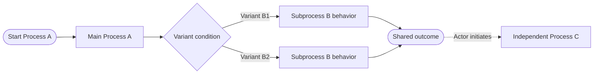

# Compact Business Process Family Template

Use this template to document multiple related business processes as one settled, agent-readable
concept. The output must describe verified behavior, not proposals or open questions.

## Authoring Rules

### Scope and Evidence

- Group processes by one business capability or domain lifecycle.
- Name exactly one main business process that owns the end-to-end trigger and shared outcome.
- Model a subprocess when the main process delegates a distinct business responsibility with its
  own stages or failure behavior. A subprocess is invoked by its parent and is not an independent
  top-level process.
- Include every independently triggered process, including stop, commit, rollback, cancellation,
  or compensation processes when they have their own trigger and outcome.
- For a complex process, variants are optional. Use a variant when data or state selects different
  stages or rules while the parent process retains the same trigger, owner, and business outcome.
- Promote a variant to a process or subprocess when it gains an independent trigger, owner,
  outcome, or failure lifecycle.
- Use domain terms from the project glossary and exact state/operation names from contracts or
  source.
- Verify behavior against current contracts, source, and tests. Do not infer behavior from names
  alone.
- State an implementation absence only after searching the complete owning repository. Otherwise
  use "not verified".
- Do not include open questions, alternatives, recommendations, or speculative behavior. Resolve
  them before publishing the concept.

### Definition

- **Outcome:** State the shared business result in one sentence.
- **Owner:** Name the role, bounded context, or service accountable for the end-to-end lifecycle.
- **Actors:** List only actors that initiate work, own a responsibility, or perform an external
  operation.
- **Main process:** Name the single end-to-end business process.
- **Subprocesses:** List the main process's direct subprocesses, or `None`.
- **Starts:** Name the actor-visible triggers that enter the process family.
- **Ends:** Name every valid terminal business state and where operation outcomes are recorded.

### Process Matrix

- Add one row for the main process and one row for each subprocess or additional independently
  triggered process. Do not add variant rows.
- Use **Level** to distinguish `Main process`, `Subprocess`, and `Independent process`.
- Use **Parent** to identify the direct parent of each subprocess; use `None` for a main or
  independent process.
- Use a verb-object Process name, such as "Commit Failover" or an established domain name.
- **Actor:** Identify who or what initiates the process.
- **Trigger:** Describe the event or explicit action that starts it.
- **Available when:** State permissions, lifecycle state, required data, and concurrency conditions.
- **Main stages:** Use short ordered stages separated by `→`; end with the resulting state when
  applicable.
- **Outcome:** Describe the business-visible result, not an implementation return value.
- **Failure behavior:** Describe persisted failure evidence, cleanup, retry, partial success, or
  compensation. Do not claim recovery behavior that source does not implement.
- Keep each cell compact. Move shared constraints to **Rules** instead of repeating them.

### Variants (Optional)

- Omit this section when no process has variants.
- Add one row per variant and identify its parent process.
- State the selection condition and only the stages, rules, outcome details, or failure behavior
  that differ from the parent.
- A variant MUST NOT introduce an independent actor-visible trigger or a different business
  outcome; model that behavior as a process instead.

### Rules

- Write only cross-process invariants and responsibility boundaries.
- Include these six categories: **Ownership**, **State**, **Concurrency**, **Finalization**,
  **Recovery**, and **Evidence**.
- Distinguish lifecycle state, task execution status, and task completion status.
- State mutual exclusion and valid transition constraints explicitly.
- Identify the evidence that survives process execution, failure, or service restart.

### Relationships

- Use a Mermaid `flowchart LR` to show ordering, branching, and terminal states.
- Use solid arrows for stages inside one process.
- Label data- or state-selected branches with their variant names.
- Use dotted arrows labelled with the actor for separately initiated follow-up processes.
- Do not draw a solid edge between independent processes; it falsely implies automatic execution.
- Show domain states as nodes when they enable or prevent another process.
- Add one sentence below the diagram defining any non-obvious edge notation.

### Implementation Map

- Use a three-column `Concern | Stable anchor | Semantic locator` table.
- Define each stable anchor as an enduring contract, responsibility, persisted entity,
  configuration key, or bounded-context role. It must remain understandable if the semantic
  locator column is removed.
- Treat names and keywords as lookup hints, not as the architectural anchor.
- Include the smallest useful set of concerns: external contract, dispatch entry point, application
  boundary, process execution, lifecycle state, persistence, operational evidence, and
  representative tests. Omit concerns that do not apply.
- Separate business state from task and persistence anchors.
- Do not use revisions, source paths, directory paths, source line numbers, namespaces, or exact
  method names.
- Identify code by interface, abstraction, or type name. Identify non-code evidence by API
  operation, configuration key, persisted entity or attribute, event name, log keyword, or test
  class name.
- If a short identifier is not unique, qualify it with the repository and bounded context, not a
  namespace or path.
- Cite a stable interface, contract, or abstraction before an implementation type.
- Name one primary implementation locator per concern and at most two supporting locators.
- Describe the behavior demonstrated by representative tests; do not merely list test classes or
  every test containing the term.
- Use "not verified" instead of an implementation-absence claim that can become stale.
- If semantic navigation is unavailable, use exact symbol/keyword search and verify the candidate
  by reading current source.

## Template

````markdown
# <Business Process Family>

## Definition

- **Outcome:** <Shared business outcome.>
- **Owner:** <End-to-end owner.>
- **Actors:** <Actor>, <participant>, <external system>.
- **Main process:** <Single end-to-end business process>.
- **Subprocesses:** <Direct subprocesses, or None>.
- **Starts:** <Actor-visible entry triggers.>
- **Ends:** <Terminal business states and recorded outcomes.>

## Process Matrix

| Level | Process | Parent | Actor | Trigger | Available when | Main stages | Outcome | Failure behavior |
| --- | --- | --- | --- | --- | --- | --- | --- | --- |
| Main process | <Process A> | None | <Initiator> | <Starting event> | <State, permissions, data, concurrency> | <Stage> → <subprocess or stage> → <resulting state> | <Business-visible result> | <Failure evidence and recovery behavior> |
| Subprocess | <Process B> | <Process A> | <Initiator or parent process> | <Parent invocation or internal condition> | <State, permissions, data, concurrency> | <Stage> → <stage> → <result> | <Contribution to the parent outcome> | <Failure evidence and recovery behavior> |

## Variants

| Parent process | Variant | Selected when | Behavioral difference |
| --- | --- | --- | --- |
| <Process B> | <Variant B1> | <Data or state condition> | <Only stages, rules, outcome details, or failure behavior that differ> |
| <Process B> | <Variant B2> | <Data or state condition> | <Only stages, rules, outcome details, or failure behavior that differ> |

## Rules

- **Ownership:** <Command intake, orchestration, and execution responsibility.>
- **State:** <Valid transitions across the process family.>
- **Concurrency:** <Mutual-exclusion and conflict behavior.>
- **Finalization:** <Explicit terminal choice or completion rule.>
- **Recovery:** <Cleanup, retry, resume, rollback, or compensation rule.>
- **Evidence:** <Persisted state, progress, metadata, result, and recovery context.>

## Relationships



Dotted edges represent separately initiated actions, not automatic continuation.

## Implementation Map

Stable anchors describe enduring ownership or contracts. Semantic locators are repository-scoped
names and keywords used to rediscover the current implementation.

| Concern | Stable anchor | Semantic locator |
| --- | --- | --- |
| External contract | <Operation, event, configuration contract, or "No external contract"> | `<repository>`: <operation, event, or configuration keys> |
| Dispatch | <Actor-visible trigger and owning boundary> | `<repository>`: <interface, abstraction, or type names> |
| Application boundary | <Capability exposed by the owning context> | `<repository>`: <interface or abstraction names> |
| Process execution | <Responsibility performed> | `<repository>`: <executor interface or type names> |
| Lifecycle state | <Authoritative state and transition owner> | `<repository>`: <state type, state values, or writer abstraction> |
| Persistence | <Persisted entity and ownership> | `<repository>`: <entity and repository abstraction names> |
| Operational evidence | <Durable logs, records, events, or results> | `<repository>`: <log keywords, event, or result type> |
| Tests | <Behavior demonstrated> | `<repository>`: <representative test class names> |
````

## Quality Gate

- Every matrix row has one trigger, availability condition, ordered flow, outcome, and failure
  behavior.
- The hierarchy names exactly one main process and identifies every subprocess parent.
- Every independently triggered process has its own row.
- Variants are optional, belong to a named parent process, and differ only by data- or state-selected
  behavior. A variant with an independent trigger or outcome is modelled as a process.
- Process names, states, and operation names match project terminology exactly.
- Diagram edges do not imply automatic execution where user or system initiation is required.
- Rules are shared invariants, not duplicated matrix content.
- Every Implementation Map row remains understandable without its Semantic locator cell.
- Every semantic locator is greppable and unambiguous within the named repository and bounded
  context.
- Implementation Map locators do not use revisions, source paths, line numbers, namespaces, or
  exact method names.
- Stable interfaces, contracts, and abstractions are cited before implementation types when they
  exist.
- Unverified implementation coverage is labelled "not verified", not claimed absent.
- Implementation claims are verified by source or tests; unavailable evidence is stated explicitly.
- The document contains no placeholders, open questions, contradictory transitions, or speculative
  claims when instantiated.
