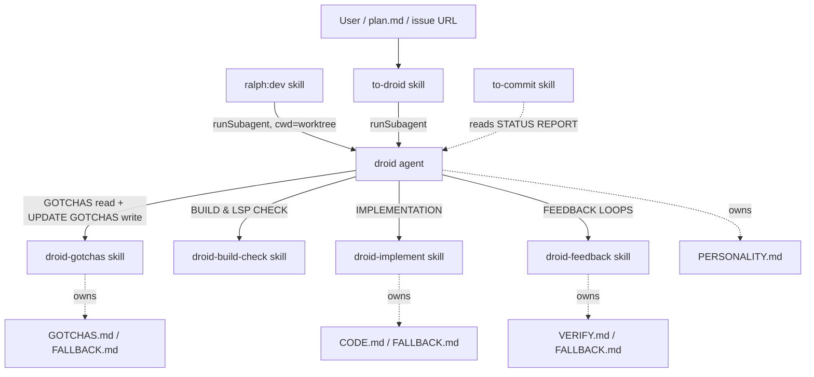
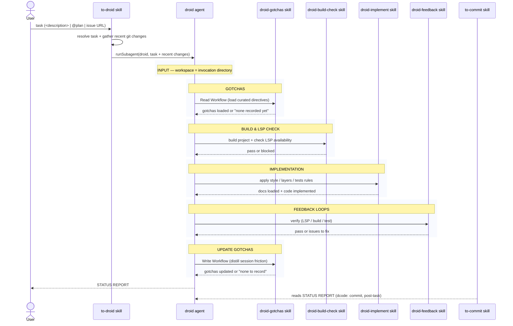

# droid

A technology-agnostic autonomous coding harness. One agent (`droid`) orchestrates a fixed pipeline; skills supply the reusable rules and the entry/exit points.

## Components

- [agents/droid.agent.md](agents/droid.agent.md) — the orchestrator. Fixed phases: INPUT → GOTCHAS → BUILD & LSP CHECK → IMPLEMENTATION → FEEDBACK LOOPS → UPDATE GOTCHAS → STATUS REPORT. Works exclusively in its invocation directory and optionally applies sibling `PERSONALITY.md`.
- [skills/to-droid/SKILL.md](skills/to-droid/SKILL.md) — entry point. Resolves a task (`<description>` | `@plan` | issue URL), gathers recent git changes, and invokes `droid` via `runSubagent`.
- [skills/droid-build-check/SKILL.md](skills/droid-build-check/SKILL.md) — builds the project and checks LSP availability before implementation.
- [skills/droid-implement/SKILL.md](skills/droid-implement/SKILL.md) — implementation rules; loads sibling `CODE.md` or bundled `FALLBACK.md` when the reference is absent.
- [skills/droid-feedback/SKILL.md](skills/droid-feedback/SKILL.md) — verify loop (LSP/build/test); loads sibling `VERIFY.md` or bundled `FALLBACK.md` when the reference is absent and runs all commands in cwd.
- [skills/droid-gotchas/SKILL.md](skills/droid-gotchas/SKILL.md) — reads sibling `GOTCHAS.md` or bundled `FALLBACK.md` before implementation, then distills session friction into new or extended directives and writes them back after feedback loops pass when the reference is present.
- [skills/to-commit/SKILL.md](skills/to-commit/SKILL.md) — commits with a `dcode:` prefix, post-task.
- [skills/setup-droid/SKILL.md](skills/setup-droid/SKILL.md) — manual, user-invoked tailoring of missing skill-owned guidance and personality references from repository evidence and bundled defaults. Not part of the agent's pipeline.

## Runtime Guidance

**Workspace = cwd** — all code, Git, build, test, and exploration commands run in the agent's invocation directory. There is no Harness Root, repository-location discovery, workspace variable, or ancestor declaration lookup.

Each consuming skill owns a mutable reference and a bundled fallback in its own directory: `droid-implement/CODE.md`, `droid-feedback/VERIFY.md`, and `droid-gotchas/GOTCHAS.md`. The Droid agent optionally reads sibling `agents/PERSONALITY.md`. A missing guidance reference is reported before its fallback is used; an absent personality uses the agent's technology-agnostic behavior; only a present `GOTCHAS.md` can receive newly observed reusable friction after successful feedback loops.

## Dependencies

**Nature of each edge**

- **Hard control-flow**: `to-droid` / `ralph:dev` → `droid` → the `droid-*` skills (named literally in the agent prose). Callers establish the invocation directory.
- **Soft/implicit**: `to-commit` depends on the agent's STATUS REPORT format (the `dcode:` convention couples them, but nothing enforces it).
- **Guidance contract**: each consuming skill resolves only its sibling reference and reports when it uses a bundled fallback.
- **Gotchas persistence**: `droid-gotchas` writes only to a present sibling `GOTCHAS.md` after feedback loops pass.

## Execution sequence

The `droid` agent runs a fixed pipeline. Each phase and the skill it invokes:

