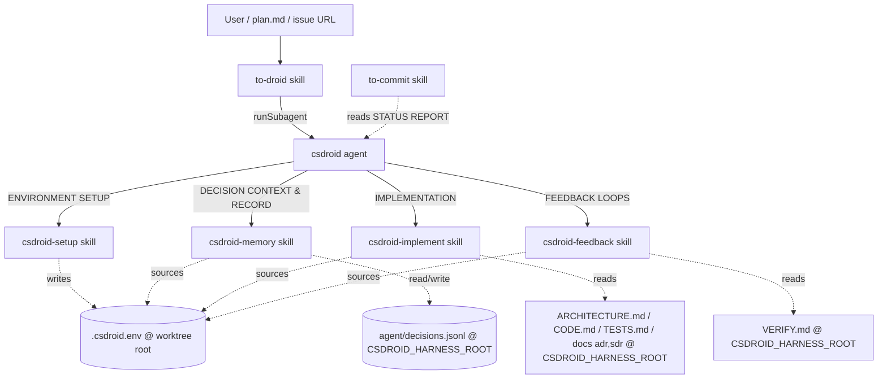

# pet

A C# autonomous coding harness. One agent (`csdroid`) orchestrates a fixed pipeline; skills supply the reusable rules and the entry/exit points.

## Components

- [agents/csdroid.agent.md](agents/csdroid.agent.md) — the orchestrator. Fixed phases: ENVIRONMENT SETUP → EXPLORATION → DECISION CONTEXT → IMPLEMENTATION → FEEDBACK LOOPS → RECORD DECISIONS → STATUS REPORT.
- [skills/to-droid/SKILL.md](skills/to-droid/SKILL.md) — entry point. Resolves a task (`<description>` | `@plan` | issue URL), gathers recent git changes, invokes `csdroid` via `runSubagent`.
- [skills/csdroid-setup/SKILL.md](skills/csdroid-setup/SKILL.md) — detects the two paths and persists them to `.csdroid.env` via `detect-env.{sh,ps1}`; other skills load them by sourcing `load-env.{sh,ps1}`.
- [skills/csdroid-implement/SKILL.md](skills/csdroid-implement/SKILL.md) — implementation rules; loads `ARCHITECTURE.md`, `CODE.md`, `TESTS.md` + selected ADR/SDR from `$CSDROID_HARNESS_ROOT`.
- [skills/csdroid-feedback/SKILL.md](skills/csdroid-feedback/SKILL.md) — verify loop (LSP/build/test/refactor); loads `VERIFY.md` from `$CSDROID_HARNESS_ROOT`.
- [skills/csdroid-memory/SKILL.md](skills/csdroid-memory/SKILL.md) — durable decision store `agent/decisions.jsonl` at `$CSDROID_HARNESS_ROOT`.
- [skills/to-commit/SKILL.md](skills/to-commit/SKILL.md) — commits with a `dcode:` prefix, post-task.

## Environment

`csdroid-setup` bundles two pairs of scripts (next to its `SKILL.md`):

- `detect-env.sh` / `detect-env.ps1` — resolve both paths and write `.csdroid.env`. Idempotent: if the file already exists they load it and skip detection. Run once, in the agent's ENVIRONMENT SETUP phase.
- `load-env.sh` / `load-env.ps1` — **sourced** by every other skill to load the variables (falling back to inline detection if `.csdroid.env` is absent, so a skill runs standalone).

`.csdroid.env` lives at the worktree top-level and is gitignored via `*.env`. The file is the persistence mechanism — a plain `export` cannot survive because each shell invocation is a fresh process.

- `CSDROID_HARNESS_ROOT` — outermost enclosing repo; owns `agent/decisions.jsonl` and **all** convention docs (`ARCHITECTURE.md`, `CODE.md`, `TESTS.md`, ADR/SDR, `VERIFY.md`).
- `CSDROID_WORKSPACE_ROOT` — the `workspace/` source repo when present, else the harness root; used for source-code operations.

## Dependencies

**Nature of each edge**

- **Hard control-flow**: `to-droid` → `csdroid` → the `csdroid-*` skills (named literally in the agent prose); `csdroid-setup` runs first in ENVIRONMENT SETUP.
- **Soft/implicit**: `to-commit` depends on the agent's STATUS REPORT format (the `dcode:` convention couples them, but nothing enforces it).
- **Environment contract**: `csdroid-setup` writes `.csdroid.env`; `csdroid-memory`, `csdroid-implement`, and `csdroid-feedback` source it (with fallback detection) to obtain `$CSDROID_HARNESS_ROOT` / `$CSDROID_WORKSPACE_ROOT`.
- **External file contracts**: `csdroid-implement` and `csdroid-feedback` depend on convention docs living at `$CSDROID_HARNESS_ROOT` (`ARCHITECTURE.md` etc.), each with its own fallback. `csdroid-memory` keeps the store at `$CSDROID_HARNESS_ROOT/agent/decisions.jsonl`.
