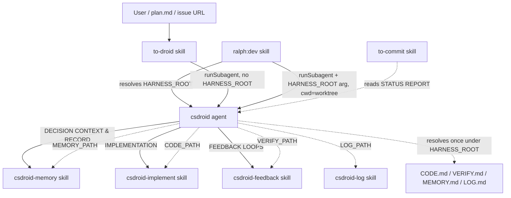

# pet

A C# autonomous coding harness. One agent (`csdroid`) orchestrates a fixed pipeline; skills supply the reusable rules and the entry/exit points.

## Components

- [agents/csdroid.agent.md](agents/csdroid.agent.md) — the orchestrator. Fixed phases: INPUT → EXPLORATION → DECISION CONTEXT → IMPLEMENTATION → FEEDBACK LOOPS → RECORD DECISIONS → STATUS REPORT. Takes an optional `HARNESS_ROOT` argument (defaults to cwd), resolves convention/state files once during INPUT, and works in its invocation directory.
- [skills/to-droid/SKILL.md](skills/to-droid/SKILL.md) — entry point. Resolves a task (`<description>` | `@plan` | issue URL), gathers recent git changes, invokes `csdroid` via `runSubagent`. Does not pass `HARNESS_ROOT` — the agent defaults it to cwd.
- [skills/csdroid-implement/SKILL.md](skills/csdroid-implement/SKILL.md) — implementation rules; consumes the `CODE_PATH` resolved during INPUT.
- [skills/csdroid-feedback/SKILL.md](skills/csdroid-feedback/SKILL.md) — verify loop (LSP/build/test/refactor); consumes the `VERIFY_PATH` resolved during INPUT and runs all commands in cwd.
- [skills/csdroid-memory/SKILL.md](skills/csdroid-memory/SKILL.md) — durable decision store `agent/decisions.jsonl` at `$HARNESS_ROOT`.
- [skills/to-commit/SKILL.md](skills/to-commit/SKILL.md) — commits with a `dcode:` prefix, post-task.

## Environment

The `csdroid` agent takes an **optional `HARNESS_ROOT` argument** — the absolute path to the repo
that owns the convention docs and the decision store. **If omitted, the agent defaults it to its
current working directory (cwd).** During INPUT, the agent resolves its convention and state files once.

- `HARNESS_ROOT` — outermost enclosing repo; owns `agent/decisions.jsonl` and all convention/state files. INPUT recursively scans only beneath it for `CODE.md`, `VERIFY.md`, `MEMORY.md`, and `LOG.md`, then passes the resolved paths to the relevant sub-skills. When no `LOG.md` exists, INPUT creates `agent/LOG.md`; missing CODE, VERIFY, and MEMORY files use their documented fallbacks.
- **Workspace = cwd** — all code, git, build, test, and exploration commands run in the agent's current working directory. There is no separate workspace variable; callers launch the agent with cwd set to the code repo/worktree.

Harness-root detection lives only in the caller. `ralph:dev` resolves and persists `HARNESS_ROOT` before launching Csdroid; `to-droid` does not resolve it, so Csdroid defaults to cwd.

## Dependencies



**Nature of each edge**

- **Hard control-flow**: `to-droid` / `ralph:dev` → `csdroid` → the `csdroid-*` skills (named literally in the agent prose). Harness-root detection lives in `ralph:dev`, not in the agent.
- **Soft/implicit**: `to-commit` depends on the agent's STATUS REPORT format (the `dcode:` convention couples them, but nothing enforces it).
- **Argument contract**: the agent receives `HARNESS_ROOT` (or defaults it to cwd), resolves the four paths during INPUT, and passes each path to the relevant `csdroid-*` skill.
- **External file contracts**: each `csdroid-*` skill consumes only the resolved path the agent supplies; INPUT owns discovery, fallback `LOG.md` creation, and discovery-gap logging.

## Execution sequence

The `csdroid` agent runs a fixed pipeline. Each phase and the skill it invokes:

```mermaid
sequenceDiagram
    actor User
    participant TD as to-droid skill
    participant AG as csdroid agent
    participant MEM as csdroid-memory skill
    participant IMP as csdroid-implement skill
    participant FB as csdroid-feedback skill
    participant TC as to-commit skill

    User->>TD: task (<description> | @plan | issue URL)
    TD->>TD: resolve task + gather recent git changes
    TD->>AG: runSubagent(csdroid, task + recent changes)

    rect rgba(160, 190, 255, 0.08)
    note over AG: INPUT — HARNESS_ROOT arg (or default cwd); resolve paths; workspace = cwd
    end

    note over AG: EXPLORATION — read changed + neighboring files, conventions

    rect rgba(160, 190, 255, 0.08)
    note over AG,MEM: DECISION CONTEXT
    AG->>MEM: Read Workflow (match prior decisions)
    MEM-->>AG: matching decision IDs or "none"
    end

    rect rgba(160, 190, 255, 0.08)
    note over AG,IMP: IMPLEMENTATION
    AG->>IMP: apply style / layers / tests rules
    IMP-->>AG: docs loaded + code implemented
    end

    rect rgba(160, 190, 255, 0.08)
    note over AG,FB: FEEDBACK LOOPS
    AG->>FB: verify (LSP / build / test / refactor)
    FB-->>AG: pass or issues to fix
    end

    rect rgba(160, 190, 255, 0.08)
    note over AG,MEM: RECORD DECISIONS
    AG->>MEM: Lookup → Add/Update / Confidence Bump
    MEM-->>AG: decision IDs recorded
    end

    AG-->>User: STATUS REPORT
    TC-->>AG: reads STATUS REPORT (dcode: commit, post-task)
```
