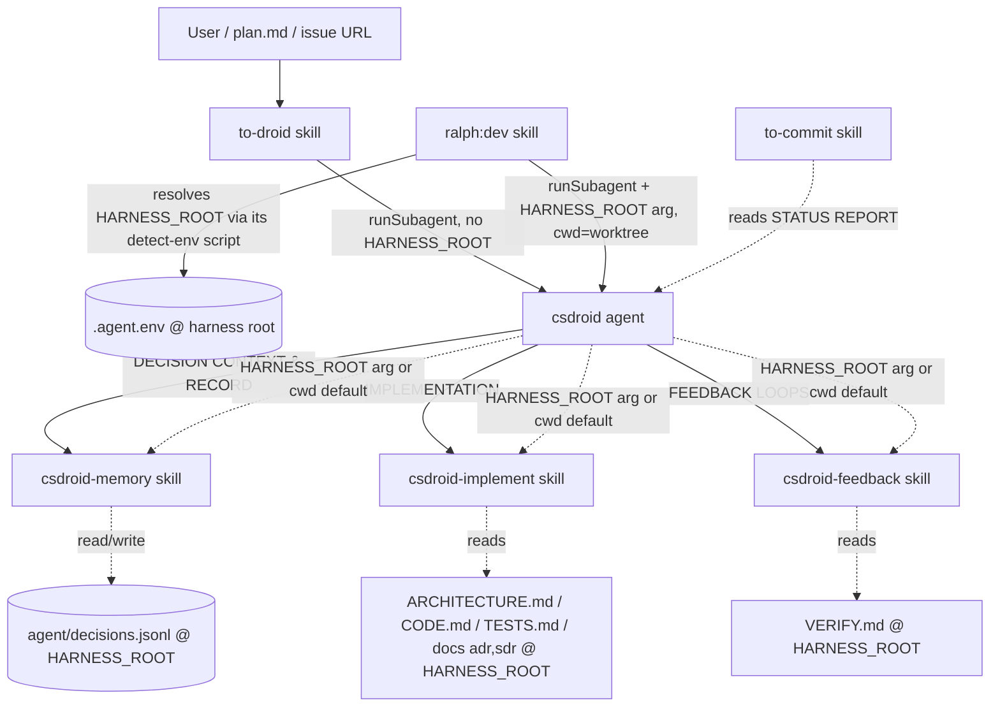

# pet

A C# autonomous coding harness. One agent (`csdroid`) orchestrates a fixed pipeline; skills supply the reusable rules and the entry/exit points.

## Components

- [agents/csdroid.agent.md](agents/csdroid.agent.md) — the orchestrator. Fixed phases: INPUT → EXPLORATION → DECISION CONTEXT → IMPLEMENTATION → FEEDBACK LOOPS → RECORD DECISIONS → STATUS REPORT. Takes an optional `HARNESS_ROOT` argument (defaults to cwd) and detects nothing itself.
- [skills/to-droid/SKILL.md](skills/to-droid/SKILL.md) — entry point. Resolves a task (`<description>` | `@plan` | issue URL), gathers recent git changes, invokes `csdroid` via `runSubagent`. Does not pass `HARNESS_ROOT` — the agent defaults it to cwd.
- [skills/csdroid-implement/SKILL.md](skills/csdroid-implement/SKILL.md) — implementation rules; loads `ARCHITECTURE.md`, `CODE.md`, `TESTS.md` + selected ADR/SDR from `$HARNESS_ROOT`.
- [skills/csdroid-feedback/SKILL.md](skills/csdroid-feedback/SKILL.md) — verify loop (LSP/build/test/refactor); loads `VERIFY.md` from `$HARNESS_ROOT`; runs all commands in cwd.
- [skills/csdroid-memory/SKILL.md](skills/csdroid-memory/SKILL.md) — durable decision store `agent/decisions.jsonl` at `$HARNESS_ROOT`.
- [skills/to-commit/SKILL.md](skills/to-commit/SKILL.md) — commits with a `dcode:` prefix, post-task.

## Environment

The `csdroid` agent takes an **optional `HARNESS_ROOT` argument** — the absolute path to the repo
that owns the convention docs and the decision store. **If omitted, the agent defaults it to its
current working directory (cwd).** The agent detects nothing; it only substitutes the resolved value.

- `HARNESS_ROOT` — outermost enclosing repo; owns `agent/decisions.jsonl` and **all** convention docs (`ARCHITECTURE.md`, `CODE.md`, `TESTS.md`, ADR/SDR, `VERIFY.md`). Skills derive their paths from it (e.g. `$HARNESS_ROOT/agent/decisions.jsonl`).
- **Workspace = cwd** — all code, git, build, test, and exploration commands run in the agent's current working directory. There is no separate workspace variable; callers launch the agent with cwd set to the code repo/worktree.

Detection lives **only in the caller** (`ralph:dev`), which bundles the detection scripts in its own
`scripts/` directory:

- `detect-env.sh` / `detect-env.ps1` — resolve `HARNESS_ROOT`, write `.agent.env` at the harness root, and echo the value. Works from the harness root or any of its worktrees. Idempotent: if the file already exists they re-echo it and skip detection. `ralph:dev` runs one of them and passes the value to the agent as `HARNESS_ROOT`. (`to-droid` does not resolve a harness root — the agent defaults to cwd.)

`.agent.env` lives at the **harness root** and is gitignored via `*.env`. Persisting it there (not the current worktree) keeps it consistent and discoverable regardless of which repo/worktree the caller runs from. The file is the persistence mechanism — a plain `export` cannot survive because each shell invocation is a fresh process.

## Dependencies



**Nature of each edge**

- **Hard control-flow**: `to-droid` / `ralph:dev` → `csdroid` → the `csdroid-*` skills (named literally in the agent prose). Harness-root detection lives in `ralph:dev` (its `scripts/detect-env.{sh,ps1}`), not in the agent.
- **Soft/implicit**: `to-commit` depends on the agent's STATUS REPORT format (the `dcode:` convention couples them, but nothing enforces it).
- **Argument contract**: the agent receives `HARNESS_ROOT` (or defaults it to cwd) and passes it to `csdroid-memory`, `csdroid-implement`, and `csdroid-feedback`; they derive their file paths from it.
- **External file contracts**: `csdroid-implement` and `csdroid-feedback` depend on convention docs living at `$HARNESS_ROOT` (`ARCHITECTURE.md` etc.), each with its own fallback. `csdroid-memory` keeps the store at `$HARNESS_ROOT/agent/decisions.jsonl`.

## Execution sequence

The `csdroid` agent runs a fixed pipeline. Each phase and the skill it invokes:

```mermaid
sequenceDiagram
    actor User
    participant TD as to-droid skill
    participant AG as csdroid agent
    participant MEM as csdroid-memory skill
    participant IMP as csdroid-implement skill
    participant FB as csdroid-feedback skill
    participant TC as to-commit skill

    User->>TD: task (<description> | @plan | issue URL)
    TD->>TD: resolve task + gather recent git changes
    TD->>AG: runSubagent(csdroid, task + recent changes)

    rect rgba(160, 190, 255, 0.08)
    note over AG: INPUT — HARNESS_ROOT arg (or default cwd); workspace = cwd
    end

    note over AG: EXPLORATION — read changed + neighboring files, conventions

    rect rgba(160, 190, 255, 0.08)
    note over AG,MEM: DECISION CONTEXT
    AG->>MEM: Read Workflow (match prior decisions)
    MEM-->>AG: matching decision IDs or "none"
    end

    rect rgba(160, 190, 255, 0.08)
    note over AG,IMP: IMPLEMENTATION
    AG->>IMP: apply style / layers / tests rules
    IMP-->>AG: docs loaded + code implemented
    end

    rect rgba(160, 190, 255, 0.08)
    note over AG,FB: FEEDBACK LOOPS
    AG->>FB: verify (LSP / build / test / refactor)
    FB-->>AG: pass or issues to fix
    end

    rect rgba(160, 190, 255, 0.08)
    note over AG,MEM: RECORD DECISIONS
    AG->>MEM: Lookup → Add/Update / Confidence Bump
    MEM-->>AG: decision IDs recorded
    end

    AG-->>User: STATUS REPORT
    TC-->>AG: reads STATUS REPORT (dcode: commit, post-task)
```
