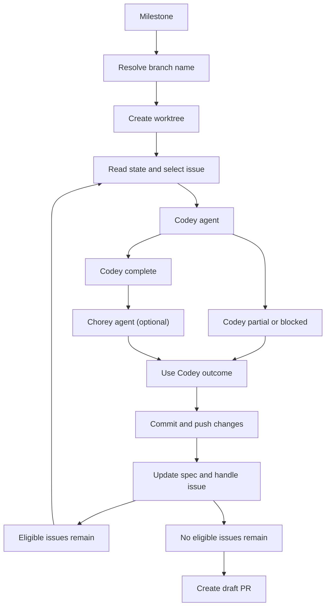
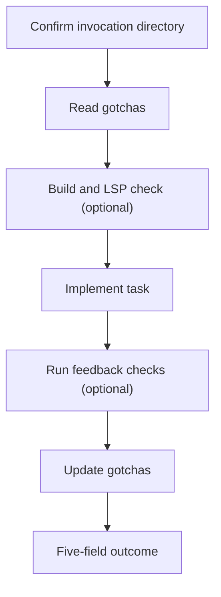
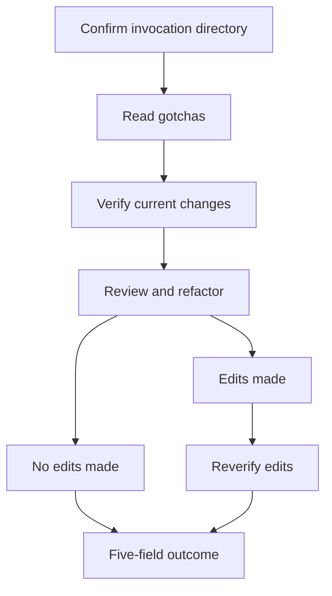

# ralph plugin

## Initialization

Install the `ralph-init` skill before using it in a repository:

```bash
gh skill install antshc/brain plugins/ralph/skills/ralph-init --agent github-copilot --dir .github/skills
```

Then open the repository in VS Code and run `/ralph-init` from its Git root.

Run `/ralph-init` from a Git repository root with `gh` available. It confirms a technology-specific persona, independently offers Build and Feedback, installs selected skills in `.github/skills`, and creates Codey and Chorey in `.github/agents`.

Core installation contains `ralph-init`, `ralph-implement`, `ralph-gotchas`, and `ralph-chore`; Build adds `ralph-build` and Feedback adds `ralph-feedback`. Initialization never overwrites an existing local Ralph skill, agent, or guidance file.


## Agents

### `codey`

Autonomous implementation agent. It works only in its invocation directory, uses the persona confirmed by `/ralph-init`, and reports `STATUS`, `SUMMARY`, `FILES`, `GOTCHAS UPDATED`, and `NOTES`.

### `chorey`

Maintainability reviewer. It uses the persona confirmed by `/ralph-init`, verifies current uncommitted work before review, applies behavior-preserving refactors only when justified, and re-verifies only after edits.

## Skills

| Skill | Description |
|---|---|
| `/to-codey <task>` | Run Codey directly for one task |
| `/to-chorey` | Review current uncommitted work with Chorey |
| `/ralph-init` | Install and configure selected Ralph skills, agents, and skill-owned guidance in a repository |
| `/ralph-build` | Run initialized `BUILD.md` guidance when the Codey BUILD gate is enabled |
| `/ralph-feedback` | Run initialized changed-file checks from `FEEDBACK.md` |
| `/ralph-gotchas` | Initialize `GOTCHAS.md` on first use and maintain grounded reusable directives |
| `/ralph-chore` | Review changes using initialized `CHORE.md` rules |
| `/ralph-dev` | AFK loop that invokes Codey then Chorey |
| `/ralph-fix` | Apply PR review comments |
| `/ralph-worktree` | Prepare a deterministic worktree and use Codey for merge conflicts |

## `/ralph-dev` workflow

`/ralph-dev <milestone-title>` creates an isolated feature worktree, processes one eligible issue per iteration, and opens a draft pull request after every eligible issue is handled. Issues labeled `spec` or `hitl` are never implemented.



### Codey agent



### Chorey agent


