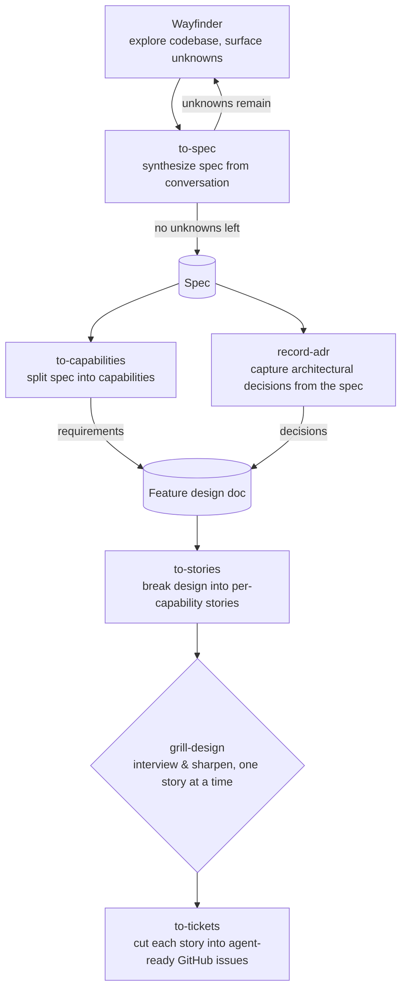

# wf plugin

Everyday workflow automation skills that carry a feature from an open-ended idea to agent-executable GitHub issues.

## Skill flow

1. **Discovery loop** — [Wayfinder](https://github.com/mattpocock/skills/tree/main/skills/engineering/wayfinder) explores the codebase and surfaces unknowns; `/to-spec` synthesizes the conversation into a spec. The two hand off to each other until no unknowns remain.
2. **Requirements capture** — `/to-capabilities` splits the spec into capabilities and adds them as requirements to the feature design doc; `/record-adr` pulls any architectural decisions out of the spec and adds them to the same doc.
3. **Story slicing** — `/to-stories` breaks the feature design doc down into one atomic story per capability.
4. **Story hardening** — `/grill-design` interviews and sharpens each story, run once per story.
5. **Ticket cut** — `/to-tickets` slices each hardened story into agent-executable GitHub issues.

