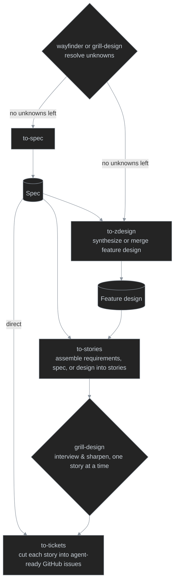

# wf plugin

Everyday workflow automation skills that carry an Initiative from an open-ended idea to agent-executable GitHub issues.

## Skill flow

1. **Discovery loop** — resolving unknowns before a spec or design is clear has two mechanics for the same purpose: [`/wayfinder`](skills/wayfinder/SKILL.md) charts a map of decision tickets on the issue tracker for work too big for one session, resolving each ticket via `/grill-design`, `/research`, or `/prototype`; `/grill-design` run directly interviews a smaller effort in one session, with no map or tickets. Either way, once no unknowns are left, the next step is `/to-spec` (or `/to-zdesign` directly).
2. **Spec synthesis** — `/to-spec` synthesizes the spec from the resolved Wayfinder decisions or grill-design conversation, the step right after the discovery loop; a spec can feed `/to-tickets` directly or go on into design synthesis.
3. **Design synthesis** — `/to-zdesign` combines resolved Wayfinder decisions and one or more specs into an authoritative feature design, reconciling capabilities and merging stronger evidence into an existing design.
4. **Story breakdown** — `/to-stories` accepts requirements, `/to-spec` output, or `/to-zdesign` output and assembles an ordered story list with numbered headings, dependencies, and Jira metadata; it runs [`/draft-story`](skills/draft-story/SKILL.md) once per story for that story's formatted title and body, while `/draft-story` also runs standalone for one User story.
5. **Story hardening** — `/grill-design` interviews and sharpens each story, run once per story.
6. **Ticket cut** — `/to-tickets` slices each hardened story into agent-executable GitHub issues.

## Skills

| Group                                     | Purpose                                      | Current skills                                                                            |
| ----------------------------------------- | -------------------------------------------- | ----------------------------------------------------------------------------------------- |
| **define- / discover-**                     | Resolve concept scope and other unknowns     | `define-concept`, `wayfinder`, `grill-design`, `questioning`, `prototype`, `explore-codebase` |
| **research-**                             | Gather external/domain evidence              | `research`, `define-research`                                                             |
| **inspect-**                              | Inspect implementations and artifacts        | `inspect-concept`, `inspect-system`, `inspect-nuget-source`                               |
| **to-**                                   | Transform one artifact/state into another    | `to-use-cases`, `to-spec`, `to-zdesign`, `to-stories`, `to-tickets`    |
| **draft-**                                | Author standalone working artifacts          | `draft-bug`, `draft-story`, `draft-adr`                                                   |
| **record-**                               | Persist established knowledge                | `record-concept`, `record-service`, `record-term`, `record-deployment-view`              |
| **doc-**                                  | Render existing knowledge                    | `doc-concept`, `doc-architecture-diagram`, `doc-behavior-diagram`, `doc-code-diagram`, `doc-contracts`, `doc-decision` |
| **docs- / setup-** , **manage- / track-** | Workflow plugin documentation infrastructure | `bootstrap-docs`, `index-docs`, `init-wf`, `manage-backlog`, `track-ledger`               |
| **normalize-**                            | Rewrite/reshape content                      | `normalize-requirements`                                                                  |

