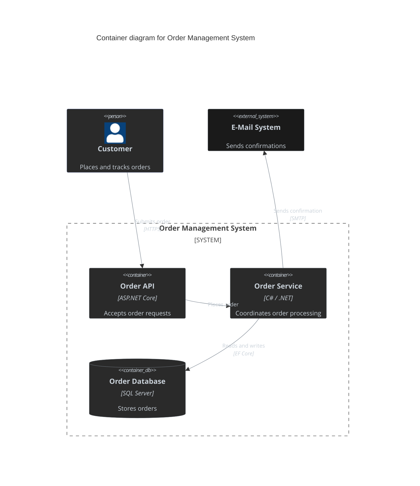
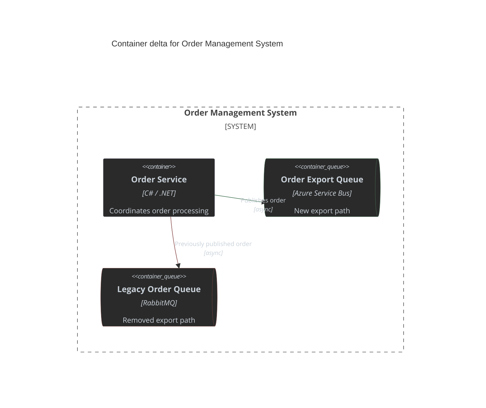
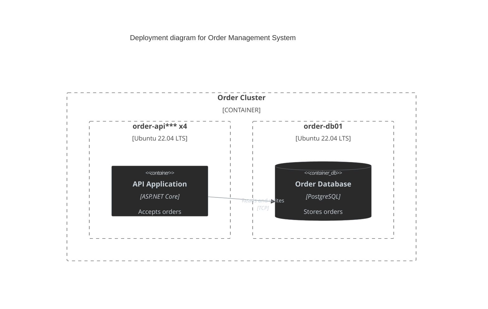
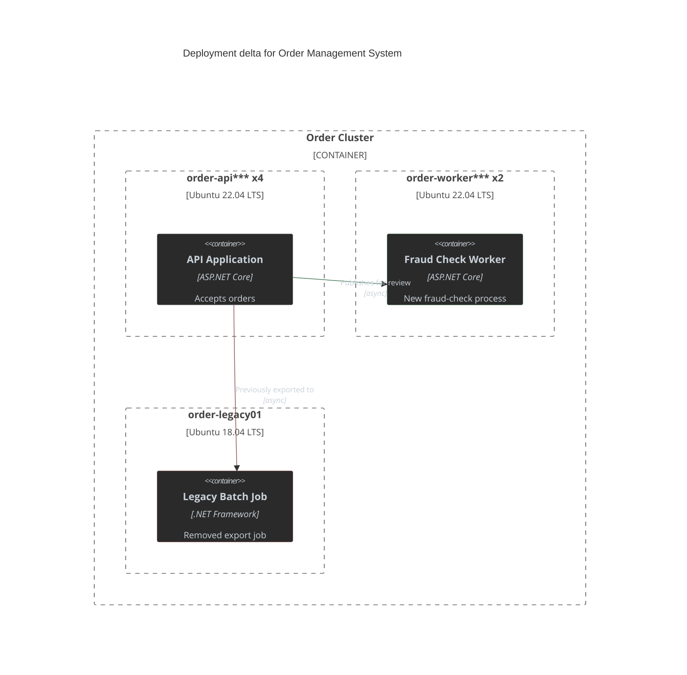

# Architecture Diagram

Presentation examples for the `architecture-diagram` skill.

## Solution Diagram Example

## Container Diagram Delta Example

**Behaviour changes**
- `+` Order Export Queue replaces the legacy export path.
- `-` Legacy Order Queue is removed.

## Deployment View Example

## Deployment View Delta Example

