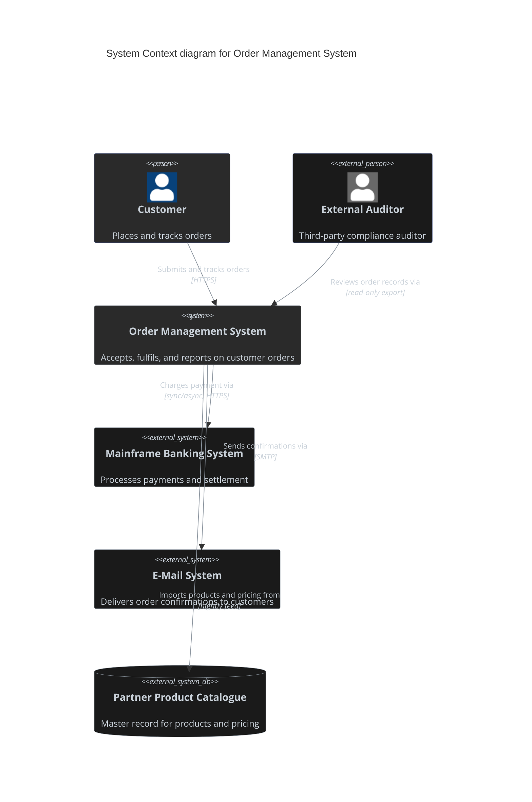
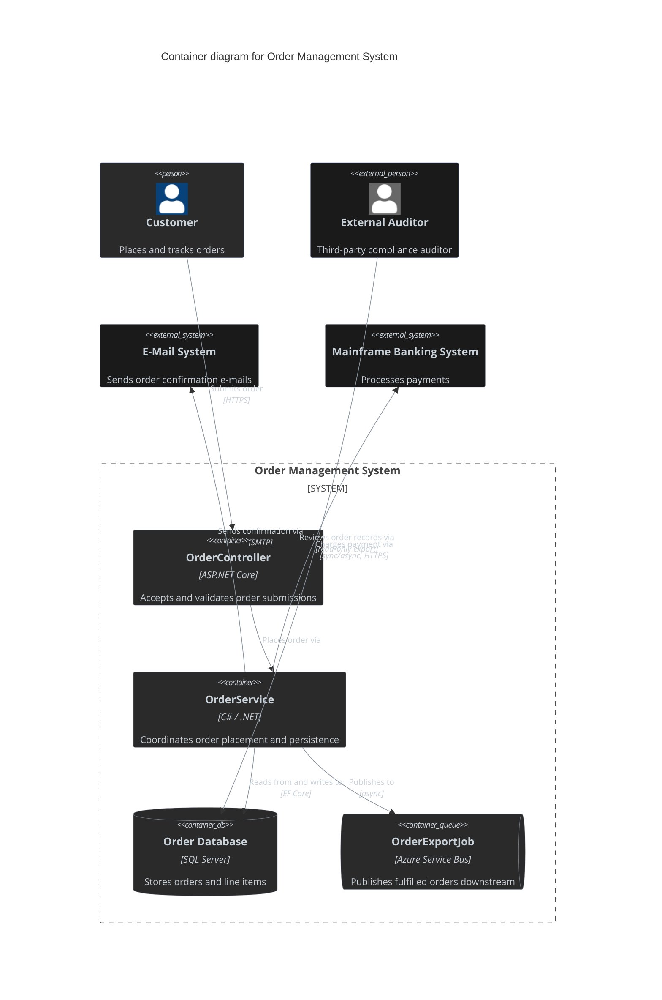
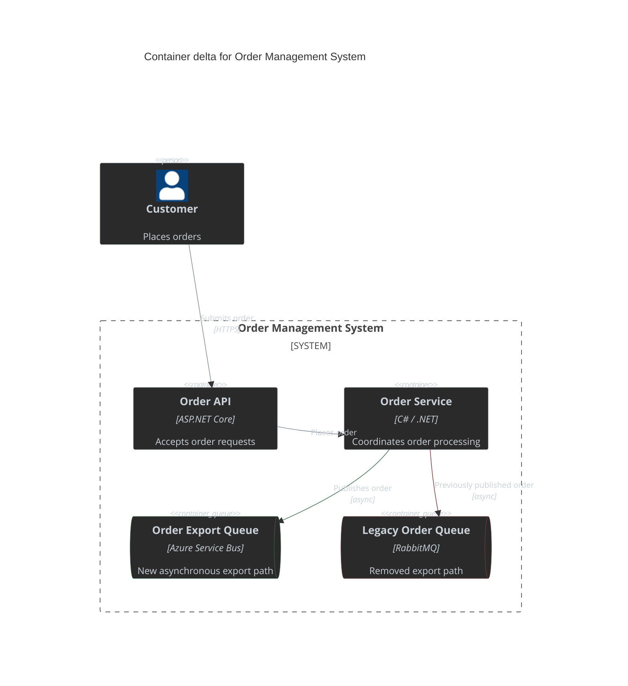
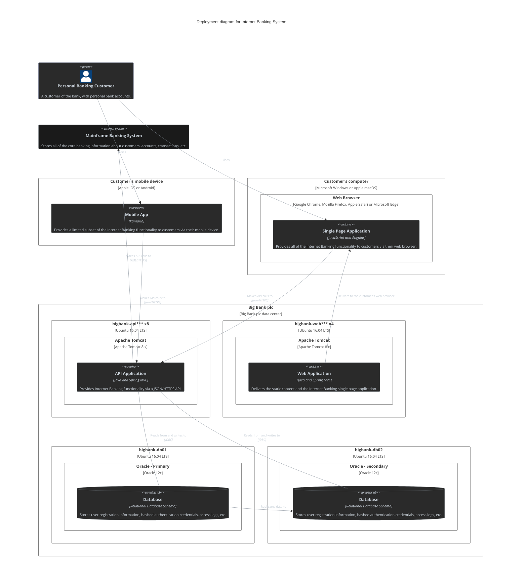
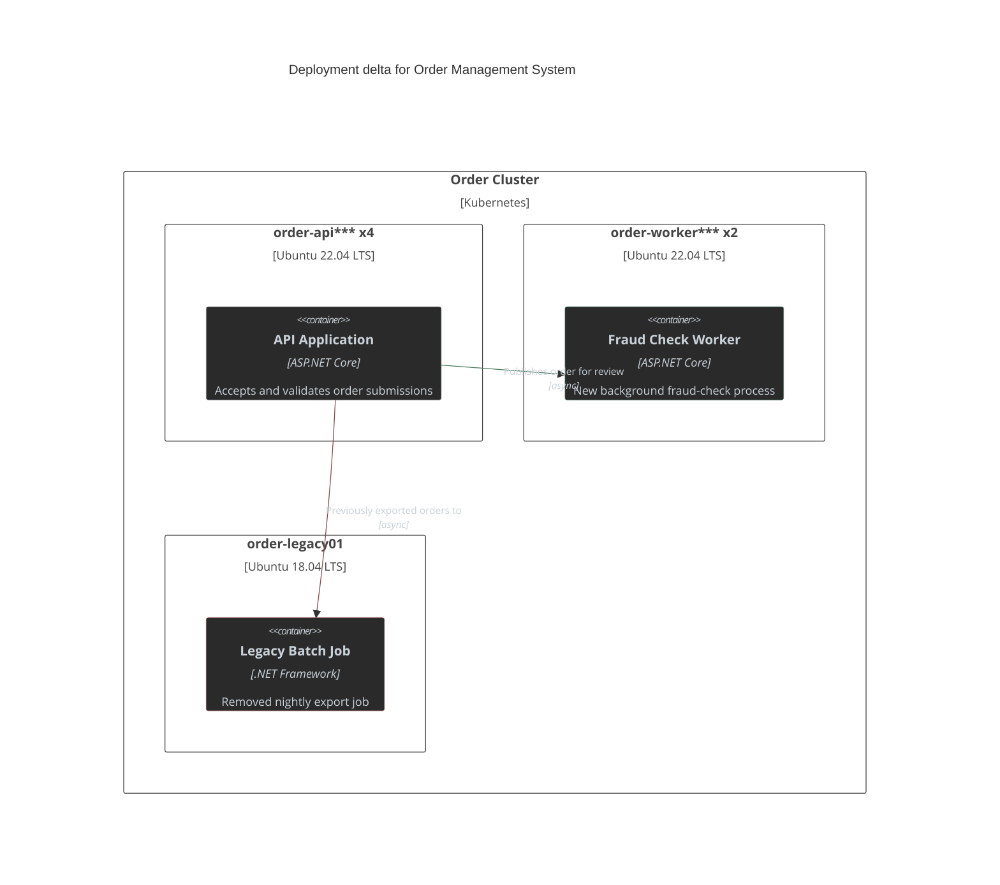

# Architecture Diagram

Presentation examples for the `architecture-diagram` skill.

## System Context Diagram Example

System Context Diagram — Order Management System

## Solution Diagram Example

Solution Diagram — Order Management System

## Container Diagram Delta Example

Order Management System — Container Delta

**Behaviour changes**
- `+` Order Export Queue replaces the legacy export path.
- `-` Legacy Order Queue is removed.
- `~` Order Service publishes exports through Azure Service Bus.

## Deployment View Example

Internet Banking Deployment Topology

## Deployment View Delta Example

Order Management System — Deployment Delta

**Behaviour changes**
- `+` Fraud Check Worker node added to run asynchronous fraud review.
- `-` Legacy Batch Job node and its host are being decommissioned.

