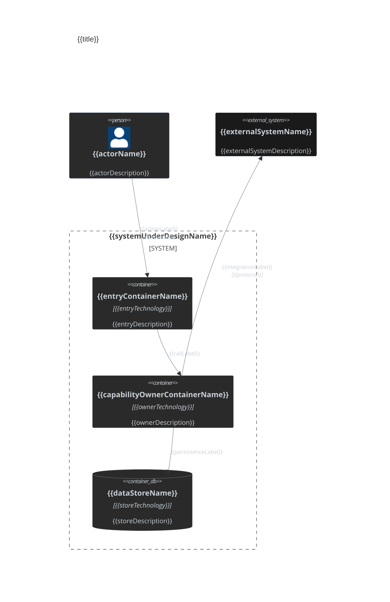

# Container Diagram Template

Official Mermaid C4 syntax: https://mermaid.ai/open-source/syntax/c4.html

## Drawing rules

- Use Mermaid `C4Container`, not `flowchart`.
- Show only elements relevant to the requested scope.
- Model architecture semantics, not repository folder structure.
- A container is one deployable/runnable operational unit.
- Group artifacts that ship and run together into one container, even when implemented with multiple files or technologies.
- Do not model classes, methods, files, scripts, or implementation details as containers unless they are independently deployable/runnable units.
- Ground current-state elements in repository/code evidence. Do not invent components.
- Prefer readable diagrams over exhaustive topology.

## C4 element reference

- `Person(alias, "Label", "Description")` — human actor inside the modeled context.
- `Person_Ext(alias, "Label", "Description")` — external human actor.
- `System(alias, "Label", "Description")` — internal system treated as opaque.
- `System_Ext(alias, "Label", "Description")` — external system treated as opaque.
- `Container(alias, "Label", "Technology", "Description")` — deployable/runnable unit.
- `Container_Ext(alias, "Label", "Technology", "Description")` — deployable/runnable unit owned outside the system/team boundary.
- `ContainerDb(alias, "Label", "Technology", "Description")` — data-store container.
- `ContainerQueue(alias, "Label", "Technology", "Description")` — queue or broker container.
- `System_Boundary(alias, "Label") { ... }` — system ownership/grouping boundary.
- `Container_Boundary(alias, "Label") { ... }` — nested logical grouping boundary.
- `Rel(from, to, "Label", "Technology")` — directed interaction or data flow.
- `Rel_Back(from, to, "Label", "Technology")` — reverse-layout relationship when needed for readability.
- `BiRel(from, to, "Label", "Technology")` — genuinely bidirectional interaction.
- `UpdateElementStyle(...)` — per-element styling.
- `UpdateRelStyle(...)` — per-relationship styling.

## Boundaries

- Use one primary `System_Boundary` for the system under design when logical ownership is relevant.
- Use boundaries to communicate architecture ownership/grouping, not directory structure.
- Avoid excessive nesting.
- Every alias must be unique and contain no spaces.
- Declare each element once, then reference its alias.

## Relationships

- Relationship direction must match the actual call or data-flow direction.
- Use `BiRel` only for genuinely bidirectional protocols, not ordinary request/response pairs.
- Prefer meaningful action labels such as `Publishes events`, `Reads configuration`, or `Stores snapshots` over vague labels such as `Uses` when the real interaction is known.
- Include technology/protocol only when architecturally relevant.
- Use `Rel_L`, `Rel_R`, `Rel_U`, or `Rel_D` only to fix layout collisions, not by default.

## Labels and descriptions

- Use human-readable architectural labels.
- Use the technology field for runtime/implementation information only when useful.
- Describe responsibility, not implementation trivia.
- Prefer architecture names over raw class, project, or folder names when a clearer name exists.
- Quote every `Label`, `Description`, and `Technology` argument, including single words.

## Current-mode styling

Use the repo dark palette.

For internal elements:

```text
$fontColor="#c9d1d9"
$bgColor="#2a2a2a"
$borderColor="#8b949e"
```

For `Person` / `Person_Ext`, use `$borderColor="#4a5a8a"` so actors remain distinguishable.

For `Person_Ext` / `Container_Ext`, use `$bgColor="#1a1a1a"` to distinguish external ownership.

Apply one `UpdateElementStyle` per element and one `UpdateRelStyle` per relationship. Relationship style:

```text
$textColor="#c9d1d9"
$lineColor="#8b949e"
```

## Delta-mode styling

Apply only when `SKILL.md` selects **delta mode**.

- added: `#4a7a5a`
- removed: `#8a4a4a`
- modified or unchanged connection context: `#8b949e`

Use `UpdateElementStyle(alias, $borderColor="...")` for element state and corresponding `UpdateRelStyle(..., $lineColor="...")` for changed relationships.

Show changed elements plus the minimum unchanged context needed to connect them.

For in-place changes not visible through topology, add:

```md
**Behaviour changes**
- + added behavior
- - removed behavior
- ~ modified behavior
```

Omit the list when no such changes exist. Do not apply delta colors in current mode.

## Mermaid C4 constraints and gotchas

- C4 has no `classDef` / `:::` styling.
- Use `UpdateElementStyle` and `UpdateRelStyle` for palette control.
- Quote all labels, descriptions, and technologies.
- Declare an element once; do not redeclare it in multiple boundaries.
- `Container_Boundary` nests inside a system/container boundary; do not use it as an unrelated top-level grouping.
- Mermaid C4 layout is statement-order-sensitive; reorder declarations before adding directional relationship variants.
- Do not rely on diagram-wide `themeVariables` for C4 palette matching.

## Output template

Replace all placeholders with real architecture. Add or remove elements and relationships to match actual scope. Do not retain unused example elements.

<details>
<summary>{{title}}</summary>



</details>
