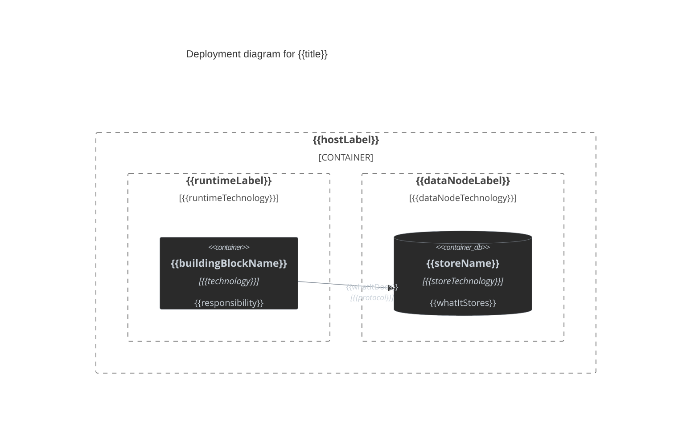

# Deployment View Template

Official Mermaid C4 syntax: https://mermaid.ai/open-source/syntax/c4.html

## Drawing rules

- Render deployment views as Mermaid `C4Container` to keep styling consistent with the repository palette.
- Show only decision-relevant deployment topology, hosting, runtimes, and deployed containers.
- Prefer deployment semantics over exhaustive production topology.
- Ground current-state elements in repository/code evidence. Do not invent hosts, runtimes, or services.
- Group artifacts that ship and run together into one deployable container.

## C4 element reference

- `Container_Boundary(alias, "Label") { ... }` — top-level deployment host, VM, device, cluster, or environment boundary.
- `Boundary(alias, "Label", "Technology") { ... }` — nested host/runtime/process inside a deployment boundary.
- `Container(alias, "Label", "Technology", "Description")` — deployed runnable unit.
- `ContainerDb(alias, "Label", "Technology", "Description")` — deployed data store.
- `Container_Ext(alias, "Label", "Technology", "Description")` — externally owned deployed unit.
- `Rel(from, to, "Label", "Technology")` — runtime call or data flow.
- `Rel_L`, `Rel_R`, `Rel_U`, `Rel_D` — directional layout variants; use only to fix collisions.
- `UpdateElementStyle(...)` — per-element styling.
- `UpdateRelStyle(...)` — per-relationship styling.

## Deployment modeling rules

- Use `Container_Boundary` for top-level hosts or deployment zones.
- Use `Boundary` for nested hosts, runtimes, OS/process layers, or sub-environments.
- Place deployed `Container`, `ContainerDb`, or `Container_Ext` elements inside the boundary that actually hosts them.
- Do not model source files, classes, scripts, or provisioning files as separate containers unless independently deployed/runnable.
- Do not create relationships solely because elements share the same host.
- Statement order affects layout; declare a boundary immediately before the elements it hosts.
- Keep labels explicit enough to show placement, runtime, and responsibility.

## Relationships

- Relationship direction must match the actual runtime interaction or data flow.
- Include protocol/technology only when architecturally relevant.
- Prefer meaningful action labels over vague labels such as `Uses`.
- Use directional relationship variants only for layout correction.

## Labels and descriptions

- Use human-readable deployment labels.
- Technology should identify runtime/hosting technology when useful.
- Description should explain responsibility or deployment role, not implementation trivia.
- Quote every `Label`, `Description`, and `Technology` argument.

## Current-mode styling

Use the repo dark palette.

For internal deployed elements:

```text
$fontColor="#c9d1d9"
$bgColor="#2a2a2a"
$borderColor="#8b949e"
```

For `Container_Ext`, use `$bgColor="#1a1a1a"`.

Apply one `UpdateElementStyle` per deployed element and one `UpdateRelStyle` per relationship:

```text
$textColor="#c9d1d9"
$lineColor="#8b949e"
```

## Delta-mode styling

Apply only when `SKILL.md` selects **delta mode**.

- added: `#4a7a5a`
- removed: `#8a4a4a`
- modified or unchanged connection context: `#8b949e`

Use `UpdateElementStyle(alias, $borderColor="...")` and matching `UpdateRelStyle(..., $lineColor="...")` for changed relationships.

Show changed deployment elements plus the minimum unchanged context needed to connect them.

For in-place changes not visible through topology, add:

```md
**Behaviour changes**
- + added behavior
- - removed behavior
- ~ modified behavior
```

Use this for runtime replacements, instance resizing, scaling-policy changes, or other in-place deployment changes. Omit when none exist.

## Mermaid C4 constraints and gotchas

- C4 has no `classDef` / `:::` styling.
- Use `UpdateElementStyle` and `UpdateRelStyle` for palette control.
- Quote all labels, descriptions, and technologies.
- Every alias must be unique and contain no spaces.
- Declare each element once.
- `Boundary` can be nested for deeper deployment/runtime structure.
- Mermaid C4 layout is statement-order-sensitive.
- Do not rely on diagram-wide `themeVariables` for C4 palette matching.

## Output template

Replace all placeholders with real deployment topology. Add or remove boundaries, containers, stores, and relationships to match the actual scope. Do not retain unused example elements.

<details>
<summary>{{title}}</summary>



</details>
