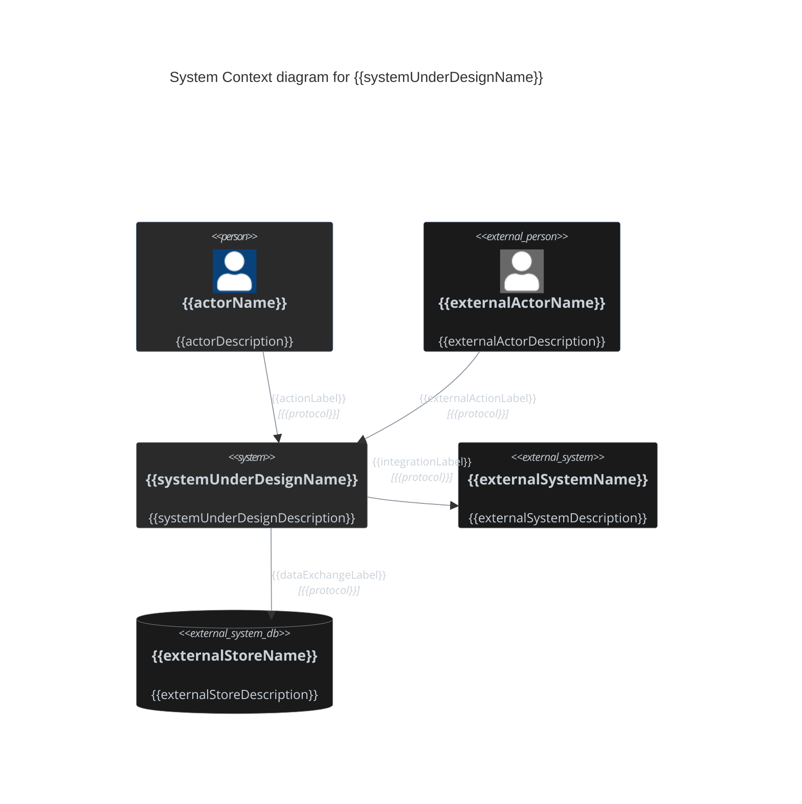

# System Context Diagram Template

Official Mermaid C4 syntax: https://mermaid.ai/open-source/syntax/c4.html

## Drawing rules

- Use Mermaid `C4Context`, not `C4Container` or `flowchart`.
- Show exactly one system under design, rendered as a single `System` box.
- Everything else is an actor or an external system the system under design talks to.
- Model scope and integration boundaries; the internal structure belongs to the Container Diagram.
- Keep containers, deployables, runtimes, classes, and files out — system context sits one level above them.
- Ground current-state elements in repository/code evidence. Do not invent actors or integrations.
- Prefer readable diagrams over exhaustive integration inventories.

## C4 element reference

- `Person(alias, "Label", "Description")` — human actor inside the modeled context.
- `Person_Ext(alias, "Label", "Description")` — external human actor.
- `System(alias, "Label", "Description")` — the system under design, or another internal system.
- `System_Ext(alias, "Label", "Description")` — external system.
- `SystemDb(alias, "Label", "Description")` / `SystemDb_Ext(...)` — system whose role is a data store.
- `SystemQueue(alias, "Label", "Description")` / `SystemQueue_Ext(...)` — system whose role is a queue or broker.
- `Enterprise_Boundary(alias, "Label") { ... }` — organisation or ownership scope.
- `System_Boundary(alias, "Label") { ... }` — grouping of several internal systems.
- `Boundary(alias, "Label", "Type") { ... }` — any other grouping, with an explicit type.
- `Rel(from, to, "Label", "Technology")` — directed interaction or data flow.
- `Rel_Back(from, to, "Label", "Technology")` — reverse-layout relationship when needed for readability.
- `BiRel(from, to, "Label", "Technology")` — genuinely bidirectional interaction.
- `UpdateElementStyle(...)` — per-element styling.
- `UpdateRelStyle(...)` — per-relationship styling.
- `UpdateLayoutConfig($c4ShapeInRow="N", $c4BoundaryInRow="N")` — row and boundary density.

## Boundaries

- Use `Enterprise_Boundary` when organisational ownership is the point being made.
- Use `System_Boundary` to group several internal systems under one owner.
- Use `Boundary` with an explicit type for anything else.
- Keep nesting shallow — context diagrams earn their value from being scannable.
- Every alias must be unique and contain no spaces.
- Declare each element once, then reference its alias.

## Relationships

- Relationship direction must match the actual call or data-flow direction.
- Use `BiRel` only for genuinely bidirectional protocols, not ordinary request/response pairs.
- Prefer meaningful action labels such as `Submits orders to`, `Sends confirmations via`, or `Reconciles payments through` over vague labels such as `Uses`.
- Include technology/protocol only when architecturally relevant.
- Use `Rel_L`, `Rel_R`, `Rel_U`, or `Rel_D` only to fix layout collisions, not by default.

## Labels and descriptions

- Use human-readable architectural labels.
- Describe the role each actor or system plays relative to the system under design.
- Prefer architecture names over raw project or vendor product names when a clearer name exists.
- Quote every `Label` and `Description` argument, including single words.

## Current-mode styling

Use the repo dark palette.

For the system under design and other internal elements:

```text
$fontColor="#c9d1d9"
$bgColor="#2a2a2a"
$borderColor="#8b949e"
```

For `Person` / `Person_Ext`, use `$borderColor="#4a5a8a"` so actors remain distinguishable.

For every `*_Ext` element, use `$bgColor="#1a1a1a"` to distinguish external ownership.

Apply one `UpdateElementStyle` per element and one `UpdateRelStyle` per relationship. Relationship style:

```text
$textColor="#c9d1d9"
$lineColor="#8b949e"
```

## Delta mode

System Context is current-mode only. Diagram a change at container level instead — see [container-diagram-template.md](container-diagram-template.md).

## Mermaid C4 constraints and gotchas

- C4 has no `classDef` / `:::` styling.
- Use `UpdateElementStyle` and `UpdateRelStyle` for palette control.
- Quote all labels and descriptions.
- Declare an element once; do not redeclare it in multiple boundaries.
- `Container`, `ContainerDb`, `ContainerQueue`, and `Container_Boundary` belong to `C4Container`; a `C4Context` diagram uses the `System*` family instead.
- Mermaid C4 layout is statement-order-sensitive; reorder declarations before adding directional relationship variants.
- Reach for `UpdateLayoutConfig` when a wide row of externals crowds the system under design.
- Do not rely on diagram-wide `themeVariables` for C4 palette matching.

## Output template

Replace all placeholders with real architecture. Add or remove elements and relationships to match actual scope. Do not retain unused example elements.

<details>
<summary>{{title}}</summary>



</details>
