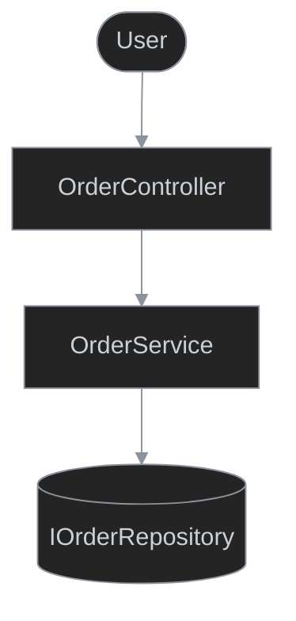
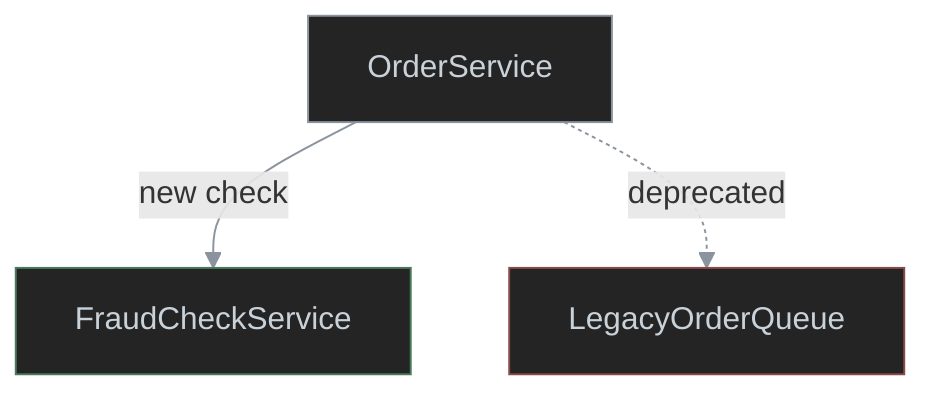
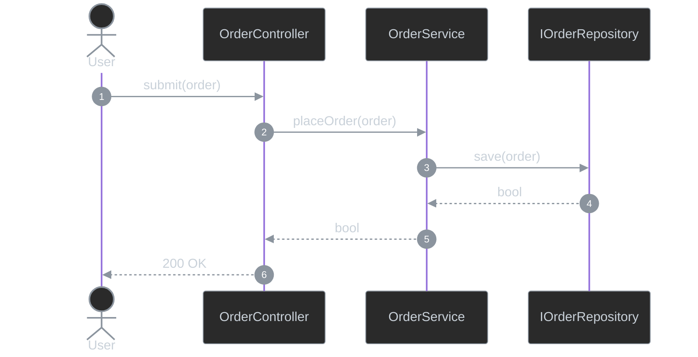
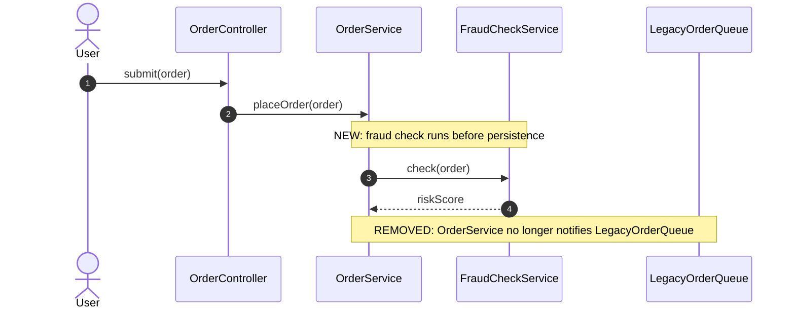

# Behavior Diagram

Presentation examples for the `behavior-diagram` skill.

## Flowchart Example



## Flowchart Delta Example



## Swimlane Diagram Example

```mermaid
%%{init: {'themeVariables': {'lineColor': '#8b949e'}}}%%
swimlane-beta TB
  subgraph frontend [Web Portal - GUI]
    submit[Customer clicks Place Order]
    showResult([Show confirmation / error])
  end

  subgraph restApi [Order Service - REST API]
    validate{Order valid and in stock?}
    placeOrder[OrderService.placeOrder]
  end

  subgraph database [Order Database - Database]
    persistOrder[Persist order with state Placed]
  end

  submit -->|1. POST order| validate
  validate -->|2a. No| showResult
  validate -->|2b. Yes| placeOrder
  placeOrder -->|3b. save order| persistOrder

  classDef default fill:#242424,stroke:#8b949e,color:#c9d1d9,stroke-width:1px
```

## Swimlane Diagram Delta Example

```mermaid
%%{init: {'themeVariables': {'lineColor': '#8b949e'}}}%%
swimlane-beta TB
  subgraph restApi [Order Service - REST API]
    placeOrder[OrderService.placeOrder]
    fraudCheck[OrderService.checkFraud]
  end

  subgraph legacyQueue [Legacy Order Queue - Queue]
    notifyLegacy[Notify legacy queue]
  end

  placeOrder -->|1. new fraud check| fraudCheck
  placeOrder -.->|deprecated notify| notifyLegacy

  classDef default fill:#242424,stroke:#8b949e,color:#c9d1d9,stroke-width:1px
  classDef added stroke:#4a7a5a,stroke-width:1px
  classDef removed stroke:#8a4a4a,stroke-width:1px
  class fraudCheck added
  class notifyLegacy removed
```

## Sequence Diagram Example



## Sequence Diagram Delta Example


