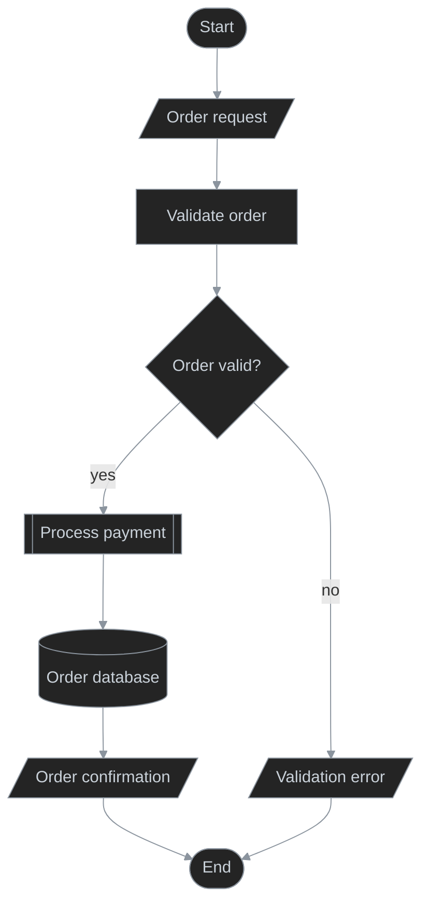
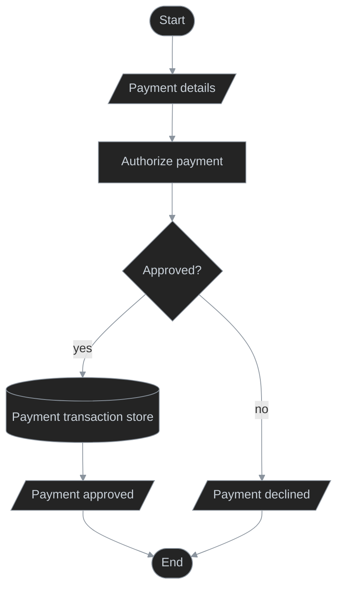
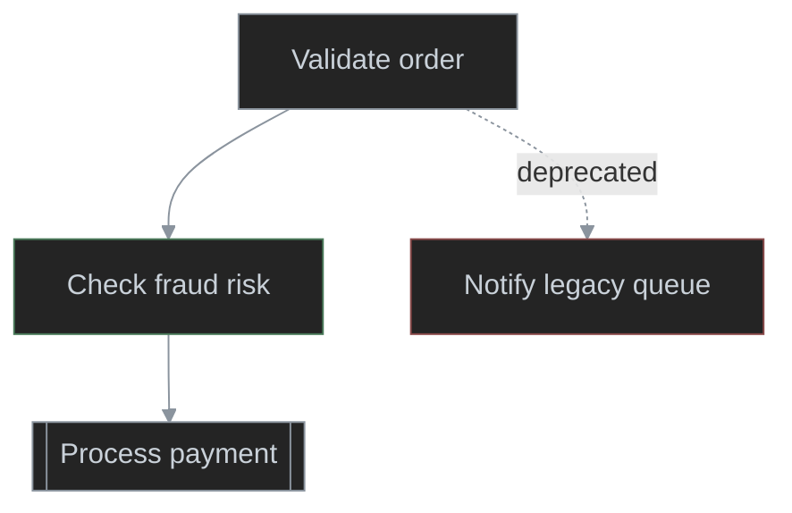
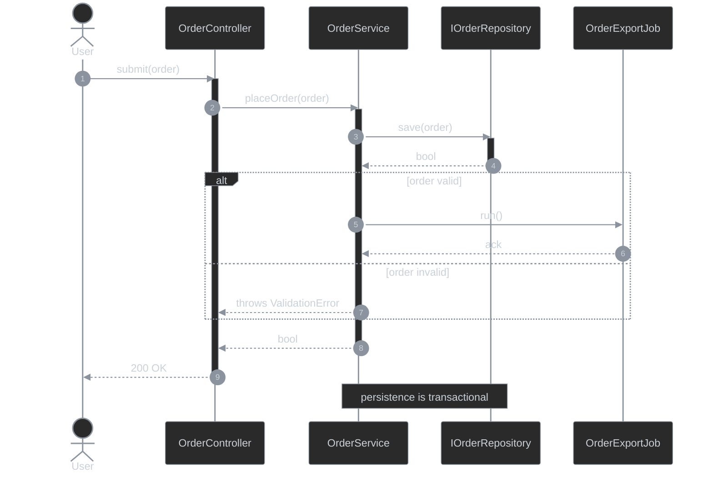
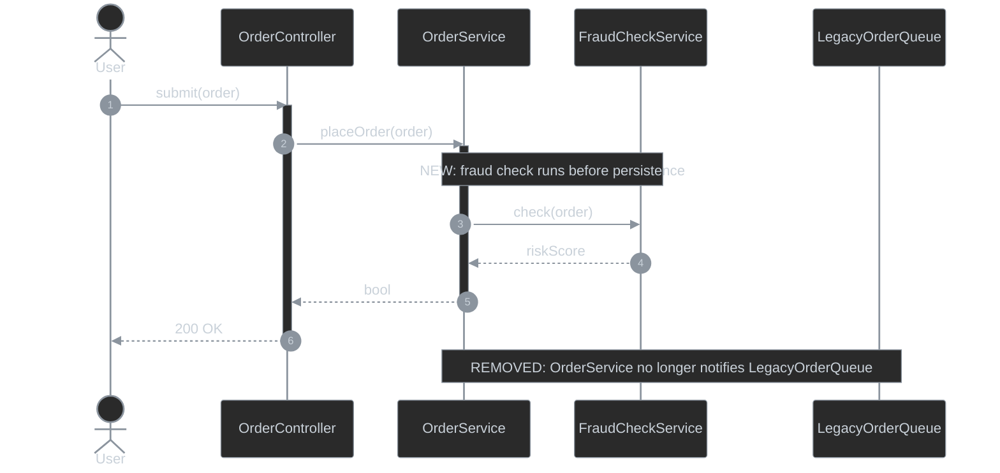

# Behavior Diagram

Presentation examples for the `behavior-diagram` skill.

## Flowchart Example

**Prompt**

> Draw the order-processing flow. Show request input, validation, payment as a subprocess, order persistence, confirmation output, and explicit start/end.

<details>
<summary>Order Processing Flowchart</summary>


</details>

## Subprocess Detail Example

**Prompt**

> Expand the `Process payment` subprocess from the order-processing flow. Show payment input, authorization, approval decision, persistence, output, and explicit start/end.

<details>
<summary>Process Payment — Subprocess</summary>


</details>

## Flowchart Delta Example

**Prompt**

> Show the order-processing delta where fraud checking is added before payment and the legacy order queue is removed. Include only changed behavior plus minimum context.

<details>
<summary>Order Processing — Flowchart Delta</summary>


</details>

## Swimlane Diagram Example

**Prompt**

> Draw the order-fulfillment responsibility flow across Customer, Order Service, and Order Database. Show input/output, validation decision, payment subprocess, persistence, and start/end.

<details>
<summary>Order Fulfillment — Solution Responsibility</summary>

```mermaid
%%{init: {'themeVariables': {'lineColor': '#8b949e'}}}%%
swimlane-beta TB
  accTitle: Order fulfillment ownership
  accDescr: Shows responsibility moving from the customer to the order service and order database.

  subgraph customer [Customer]
    start([Start])
    submit[/Place order/]
    result[/Confirmation or error/]
    endNode([End])
  end

  subgraph restApi [Order Service - REST API]
    validate[Validate order]
    valid{Order valid and in stock?}
    payment[[Process payment]]
  end

  subgraph database [Order Database - Database]
    persistOrder[(Order database)]
  end

  start --> submit -->|order request| validate --> valid
  valid -->|invalid| result
  valid -->|valid| payment --> persistOrder --> result --> endNode

  classDef default fill:#242424,stroke:#8b949e,color:#c9d1d9,stroke-width:1px
```
</details>

## Swimlane Internal Responsibility Example

**Prompt**

> Draw the internal order-processing responsibility flow across OrderController, OrderService, and OrderRepository. Show request input, validation, persistence, response output, and start/end.

<details>
<summary>Order Processing — Internal Responsibility</summary>

```mermaid
%%{init: {'themeVariables': {'lineColor': '#8b949e'}}}%%
swimlane-beta TB
  accTitle: Order service internal ownership
  accDescr: Shows responsibility moving between controller, service, and repository components inside the order service.

  subgraph controller [OrderController - Controller]
    start([Start])
    receive[/Order request/]
    returnResult[/Order result/]
    endNode([End])
  end

  subgraph service [OrderService - Service]
    validate[Validate order]
    valid{Order valid?}
    createOrder[Create order]
  end

  subgraph repository [OrderRepository - Repository]
    saveOrder[(Order store)]
  end

  start --> receive --> validate --> valid
  valid -->|invalid| returnResult
  valid -->|valid| createOrder -->|order| saveOrder --> returnResult --> endNode

  classDef default fill:#242424,stroke:#8b949e,color:#c9d1d9,stroke-width:1px
```
</details>

## Swimlane Diagram Delta Example

**Prompt**

> Show the order-fulfillment responsibility delta: add fraud validation before persistence and remove the legacy queue handoff. Include only changed behavior plus minimum context.

<details>
<summary>Order Fulfillment — Swimlane Delta</summary>

```mermaid
%%{init: {'themeVariables': {'lineColor': '#8b949e'}}}%%
swimlane-beta TB
  accTitle: Order fulfillment responsibility changes
  accDescr: Adds fraud validation before persistence and removes the legacy queue handoff.

  subgraph restApi [Order Service - REST API]
    createOrder[Create order]
    fraudCheck[Check fraud risk]
  end

  subgraph database [Order Database - Database]
    persistOrder[(Order database)]
  end

  subgraph legacyQueue [Legacy Order Queue - Queue]
    notifyLegacy[Notify legacy queue]
  end

  createOrder -->|order| fraudCheck
  fraudCheck -->|approved order| persistOrder
  createOrder -.->|legacy notification| notifyLegacy

  classDef default fill:#242424,stroke:#8b949e,color:#c9d1d9,stroke-width:1px
  classDef added stroke:#4a7a5a,stroke-width:1px
  classDef removed stroke:#8a4a4a,stroke-width:1px
  class fraudCheck added
  class notifyLegacy removed
```

**Behaviour changes**
- `-` The entire "Legacy Order Queue" lane is being removed; Mermaid's `subgraph` has no supported border-color hook, so the removal is called out here in prose.

</details>

## Sequence Diagram Example

**Prompt**

> Draw the order-submission sequence between User, OrderController, OrderService, repository, and export job. Include activation, validation branching, returns, and the persistence note.

<details>
<summary>Order Submission Sequence</summary>


</details>

## Sequence Diagram Delta Example

**Prompt**

> Show the order-submission sequence delta where OrderService calls FraudCheckService before persistence and no longer notifies LegacyOrderQueue. Include only enough unchanged interaction for context.

<details>
<summary>Order Submission — Sequence Delta</summary>


</details>
