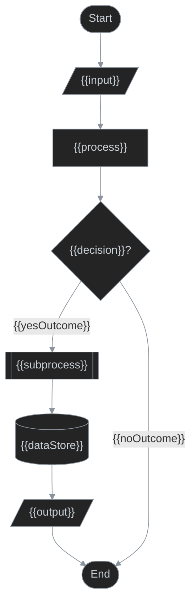

# Flowchart Template

Official Mermaid flowchart syntax: https://mermaid.ai/open-source/syntax/flowchart.html

## Drawing rules

- Use Mermaid `flowchart` for a process flow, decision path, or component wiring.
- Show decision-relevant nodes and edges, not a full system topology.
- Use a swimlane diagram instead when ownership of steps matters.
- Use a sequence diagram instead when message order between participants matters.
- Ground current-state nodes and relationships in repository/code evidence. Do not invent behavior.
- Show only elements relevant to the requested scope.
- Prefer readable flow over exhaustive detail.
- Standardize on the shape vocabulary below. Avoid exotic Mermaid shapes unless the user explicitly asks for them.

## Standard node vocabulary

- `id(["Start"])` / `id(["End"])` — process start or end.
- `id["Process"]` — process/action/activity.
- `id{"Decision?"}` — decision with explicit branches.
- `id[["Subprocess"]]` — subprocess whose internal flow is intentionally hidden at this level.
- `id[("Data store")]` — persistent data store/repository/database.
- `id[/"Input / Output"/]` — input or output entering/leaving the process.

Use short, stable node IDs and descriptive labels. Never use `click` as a node ID; it is a reserved Mermaid interaction keyword.

## Subprocess rules

- Use a **Process** when the step is fully represented in the current diagram.
- Use a **Subprocess** when the step has a meaningful child flow that is intentionally hidden to keep the parent diagram at one abstraction level.
- Do not use a subprocess merely because implementation spans multiple methods, classes, or files.
- If subprocess internals are relevant, create a separate diagram named after the subprocess and expand only that child flow there.
- Keep the subprocess label stable between parent and child diagrams so the drill-down relationship is obvious.

## Grouping

- `subgraph Name ... end` — group related existing nodes without redeclaring them.

## Relationships

- `-->` — normal directed flow.
- `-- text -->` — directed flow with a condition or handoff label.
- `-.text.->` — deprecated, exceptional, or non-primary path.
- Relationship direction must match the actual process or data-flow direction.
- Label decisions and non-obvious handoffs with meaningful text.
- Use `flowchart TD` for top-down flows and `flowchart LR` for wide pipelines when it improves readability.

## Current-mode styling

Use the repo dark palette.

```text
lineColor: #8b949e
fill: #242424
stroke: #8b949e
text: #c9d1d9
```

Keep this initialization and default class definition in current mode:

```mermaid
%%{init: {'themeVariables': {'lineColor': '#8b949e'}}}%%
classDef default fill:#242424,stroke:#8b949e,color:#c9d1d9,stroke-width:1px
```

## Delta-mode styling

Apply only when `SKILL.md` selects **delta mode**.

- Added node: `:::added` with `classDef added stroke:#4a7a5a,stroke-width:1px`.
- Removed node: `:::removed` with `classDef removed stroke:#8a4a4a,stroke-width:1px`.
- There is no class-diagram-style `memberChanged` equivalent. For a materially changed node, either style it as added when the replacement is what matters, or leave it base-styled and describe the change in prose.
- Show changed nodes/edges plus the minimum unchanged context needed to connect them.
- Omit unchanged nodes not needed to understand the delta.
- Do not apply delta styling in current mode.

## Mermaid constraints and gotchas

- A `subgraph` can group existing nodes and can itself be an edge target.
- Mermaid parsing can report a reserved-ID error on a later edge instead of the offending node declaration; avoid `click` as an ID.
- Pick `TD` or `LR` based on readability rather than convention.
- Delete unused placeholders and example nodes from the final diagram.

## Output template

Replace all placeholders with real behavior. Add or remove nodes and relationships to match the actual scope.

<details>
<summary>{{title}}</summary>



</details>
