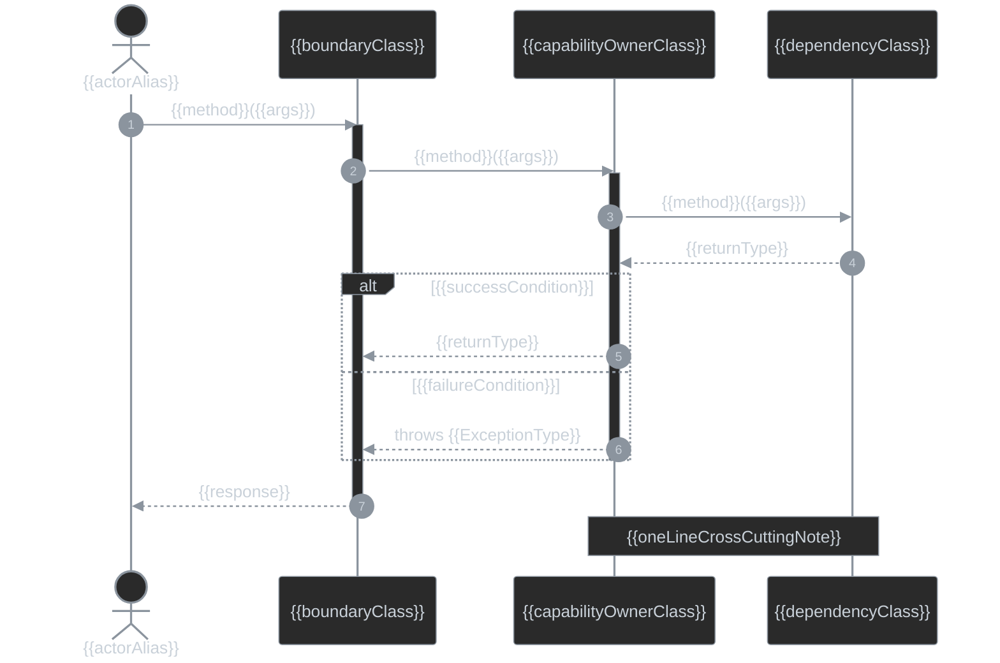

# Sequence Diagram Template

Official Mermaid sequence diagram syntax: https://mermaid.ai/open-source/syntax/sequenceDiagram.html

## Drawing rules

- Use Mermaid `sequenceDiagram` when interaction order, cross-boundary calls, returns, or failure branching are design decisions.
- Show only lifelines and messages relevant to the requested scenario, not a full system trace.
- Ground current-state participants and interactions in repository/code evidence. Do not invent calls.
- Use `actor` for a human/external initiator and `participant` for a system component.
- Use `participant X as ClassName` when a short lifeline ID improves readability.
- Keep `autonumber` as the first line under `sequenceDiagram` so review comments can reference steps by number.
- Prefer readable scenarios over exhaustive traces.

## Calls, returns, and control flow

- `->>` — synchronous call.
- `-->>` — return from a synchronous call.
- Pair every synchronous call with its matching return when the return is relevant; an unpaired call reads as fire-and-forget.
- Use `activate` / `deactivate` or `+` / `-` shorthand to show active call-stack ownership.
- Use `alt` / `else` / `end` for mutually exclusive outcomes.
- Use `opt` / `end` for a single conditional path without an alternative.
- Use `note over A,B: text` for a short cross-cutting concern that does not belong on one message.

## Current-mode styling

Use the repo dark palette through `themeVariables`, because sequence diagrams do not support the class-style `classDef` palette.

```text
fill: #2a2a2a
stroke/line: #8b949e
text: #c9d1d9
```

Keep the theme block from the output template in current mode.

## Delta-mode styling

Apply only when `SKILL.md` selects **delta mode**.

Mermaid sequence diagrams have no `:::` / `classDef` mechanism for individual messages.

- Mark a new, changed, or removed step with a `note over` callout or a leading `NEW:`, `CHANGED:`, or `REMOVED:` label in message text.
- Use `REMOVED:` for a call that no longer happens but must remain visible to explain the delta.
- Show changed messages plus the minimum unchanged lifelines/messages needed to connect the scenario.
- Omit unchanged lifelines and messages not needed to understand the delta.
- Keep the base palette; do not invent unsupported per-message color semantics.

## Mermaid constraints and gotchas

- A literal `;` in message or note text is parsed as a statement terminator and can break parsing. Use `-` or `,` instead.
- Activation bars should match actual call-stack lifetime.
- Use `actor` only for a human/external initiator; system lifelines should be `participant`.
- Delete unused placeholders, lifelines, messages, branches, and notes from the final diagram.

## Output template

Replace all placeholders with real participants and interactions. Add or remove lifelines, calls, branches, activations, and notes to match the actual scenario.

<details>
<summary>{{title}}</summary>



</details>
