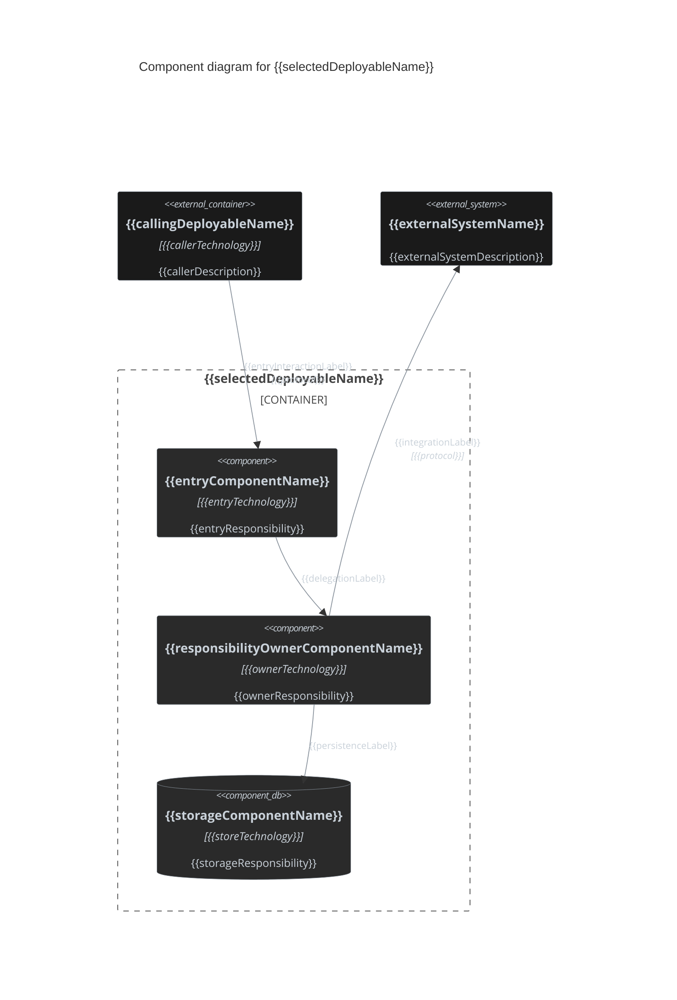

# Component Diagram Template

Official Mermaid C4 syntax: https://mermaid.ai/open-source/syntax/c4.html

## Drawing rules

- Use Mermaid `C4Component`, not `C4Container`, `classDiagram`, or `flowchart`.
- Decompose exactly one selected deployable and place its components inside one `Container_Boundary`.
- Show only architecturally relevant internal responsibilities and dependencies needed for the requested scope.
- Model components as cohesive units with a stable responsibility or interface inside the selected deployable.
- Keep methods, files, scripts, and incidental helper classes out.
- Treat IDesign-style Manager, Engine, or Accessor classes as components only when their responsibility or interface is architecturally relevant inside the selected deployable.
- Ground current-state elements in repository/code evidence. Do not invent components or dependencies.
- Prefer readable diagrams over exhaustive class inventories.

## C4 element reference

- `Component(alias, "Label", "Technology", "Description")` — architecturally relevant responsibility or interface inside the selected deployable.
- `Component_Ext(alias, "Label", "Technology", "Description")` — component owned outside the selected deployable when its component-level relationship is relevant.
- `ComponentDb(alias, "Label", "Technology", "Description")` — component whose architectural responsibility is data storage.
- `ComponentQueue(alias, "Label", "Technology", "Description")` — component whose architectural responsibility is queueing or brokering.
- `Container_Boundary(alias, "Label") { ... }` — the one selected deployable being decomposed.
- `Container(alias, "Label", "Technology", "Description")` / `Container_Ext(...)` — another deployable treated as opaque context.
- `System(alias, "Label", "Description")` / `System_Ext(...)` — another system treated as opaque context.
- `Rel(from, to, "Label", "Technology")` — directed dependency, call, or data flow.
- `Rel_Back(from, to, "Label", "Technology")` — reverse-layout relationship when needed for readability.
- `BiRel(from, to, "Label", "Technology")` — genuinely bidirectional interaction.
- `UpdateElementStyle(...)` — per-element styling.
- `UpdateRelStyle(...)` — per-relationship styling.

## Boundary

- Use exactly one `Container_Boundary` for the selected deployable.
- Keep external containers and systems outside that boundary and opaque.
- Use the boundary to communicate the selected deployable, not a namespace or directory.
- Every alias must be unique and contain no spaces.
- Declare each element once, then reference its alias.

## Relationships

- Relationship direction must match the actual dependency, call, or data-flow direction.
- Prefer meaningful action labels such as `Validates through`, `Coordinates with`, or `Persists through` over vague labels such as `Uses` when the real interaction is known.
- Include technology/protocol only when architecturally relevant.
- Use `BiRel` only for genuinely bidirectional protocols, not ordinary request/response pairs.
- Use `Rel_L`, `Rel_R`, `Rel_U`, or `Rel_D` only to fix layout collisions, not by default.

## Labels and descriptions

- Use human-readable architectural labels.
- Use the technology field only when it helps distinguish an interface, runtime, or persistence mechanism.
- Describe each component's responsibility, not implementation trivia.
- Prefer architecture names over raw class names when a clearer name exists.
- Quote every `Label`, `Description`, and `Technology` argument, including single words.

## Current-mode styling

Use the repo dark palette.

For internal elements:

```text
$fontColor="#c9d1d9"
$bgColor="#2a2a2a"
$borderColor="#8b949e"
```

For external elements, use `$bgColor="#1a1a1a"` to distinguish external ownership.

Apply one `UpdateElementStyle` per element and one `UpdateRelStyle` per relationship. Relationship style:

```text
$textColor="#c9d1d9"
$lineColor="#8b949e"
```

## Delta-mode styling

Apply only when `SKILL.md` selects **delta mode**.

- added: `#4a7a5a`
- removed: `#8a4a4a`
- modified or unchanged connection context: `#8b949e`

Use `UpdateElementStyle(alias, $borderColor="...")` for component state and corresponding `UpdateRelStyle(..., $lineColor="...")` for changed relationships.

Show changed components plus the minimum unchanged context needed to connect them, all within the one selected deployable boundary.

For in-place responsibility changes not visible through topology, add:

```md
**Behaviour changes**
- + added behavior
- - removed behavior
- ~ modified behavior
```

Omit the list when no such changes exist. Do not apply delta colors in current mode.

## Mermaid C4 constraints and gotchas

- C4 has no `classDef` / `:::` styling.
- Use `UpdateElementStyle` and `UpdateRelStyle` for palette control.
- Quote all labels, descriptions, and technologies.
- Declare an element once; do not redeclare it inside and outside the selected boundary.
- Mermaid C4 layout is statement-order-sensitive; reorder declarations before adding directional relationship variants.
- Do not rely on diagram-wide `themeVariables` for C4 palette matching.

## Output template

Replace all placeholders with real architecture. Add or remove components, context, and relationships to match actual scope. Do not retain unused example elements.

