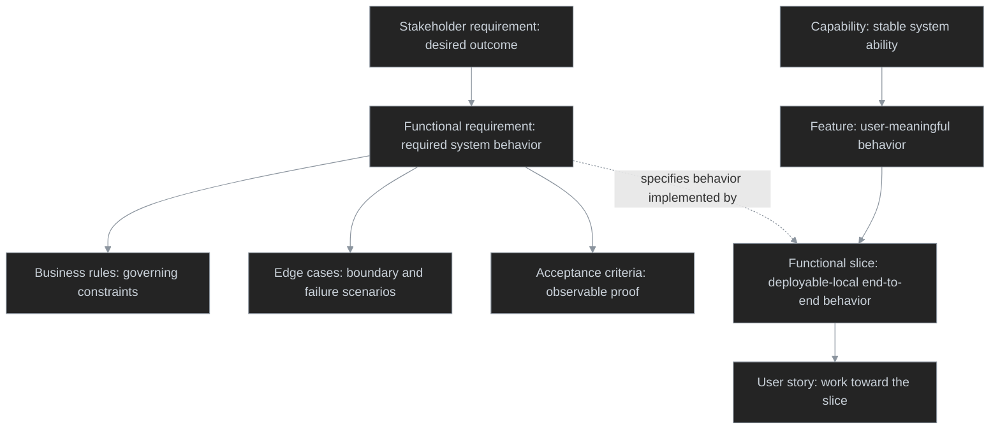

# Solution-Agnostic

Scrub requirement, capability, feature, functional slice, or story text of implementation artifacts so every statement names a **behavior and entity** — what the system *does* and the outcome the actor gets — never the thing that is built to deliver it (widget, screen, table, endpoint, flag, access role).

## The rule

Every statement is solution-agnostic: it names a behavior and an entity, never an implementation artifact. This governs **capability titles**, **feature descriptions**, **functional slice descriptions**, **stakeholder requirements**, **functional requirements**, **business rules**, **edge cases**, and **acceptance criteria** alike.

## Preserve requirement structure

Keep this requirement structure intact while normalizing:

```text
Stakeholder requirement
	↓
Functional requirement
	├── Business rules
	├── Edge cases
	└── Acceptance criteria
```

- A **Stakeholder requirement** states the desired outcome: *An administrator can control session lifetime.*
- A **Functional requirement** states the required system behavior: *The system lets an administrator configure session lifetime.*
- A **Business rule** states the governing constraint: *Session lifetime must be from one hour through 30 days.*
- An **Edge case** states a boundary, unusual, failure, or exceptional scenario: *A configured session lifetime is zero, absent, expired, or changes while sessions are active.*
- An **Acceptance criterion** states observable proof: *When the administrator configures a session lifetime of zero, the system rejects it and explains the validation failure.*

Normalize each item at its own level. Do not turn a business rule or edge case into an acceptance criterion, collapse several criteria into a functional requirement, or introduce implementation details while making a criterion observable.

## Preserve the hierarchy

Keep the source text at its existing level. Normalize wording; do not promote or demote scope.



- A **Capability** is a stable, high-level system ability.
- A **Feature** is a user-meaningful product behavior that delivers all or part of a capability.
- A **Functional slice** is an end-to-end implementation of one distinct behavior or outcome within one deployable; connected deployables own related slices linked by contracts.
- A **User story** expresses work toward one functional slice; keep its referenced capability, feature, and functional-slice scope unchanged.

Do not replace a defined **Feature** or **Functional slice** with a generic capability, requirement, or story. Their names are domain terms when supplied by the glossary; scrub only leaked artifacts within their descriptions.

## The domain glossary exception

A **domain glossary** is an allowed list of terms the business already uses to name entities and behaviors. When one is provided:
- **Prefer the domain glossary.** Use its terms verbatim for entities, states, and behaviors instead of inventing paraphrases, even when a term looks like an artifact.
- **Allow any term defined in the glossary.** A term on the allowed list is treated as domain language, not a leaked artifact — keep it as-is and do not de-reference it.
- Continue to scrub every term that is **not** in the glossary using the swap test and the de-referencing tables below.

## The swap test

If swapping the UI or the technology would force a reword, the statement is over-specified. Apply the test to every line:
- Reject: *Surface active alerts in the page header* · *Manage tasks on the Monitoring page* · *Store the soft-delete flag*.
- Prefer: *Surface the count of active alerts* · *Manage tasks* · *Keep a deleted item recoverable for its retention window*.

## The de-referencing move

When a statement names an artifact, raise it **one level** to the behavior it enables and push the artifact down into design:
1. Find the artifact term (a screen, column, endpoint, status flag, worker, access role).
2. Ask what the actor actually gets from it — what they perceive, can do, or are told.
3. Rewrite the statement as that behavior + entity; drop the artifact.

## Apply the de-referencing tables

**Always** apply the bundled tables in [references/solution-agnostic-terms.md](references/solution-agnostic-terms.md) — they map leaked artifacts (UI, data, API, domain-state, process, access) to the behavior to state instead.

## Output

Return the same text with every artifact term scrubbed and raised to behavior + entity, preserving each item's Capability, Feature, Functional slice, or Story level and relationships. Follow with a short note listing each correction made (the leaked term → the behavior it became). If no artifact terms remain, say so.
