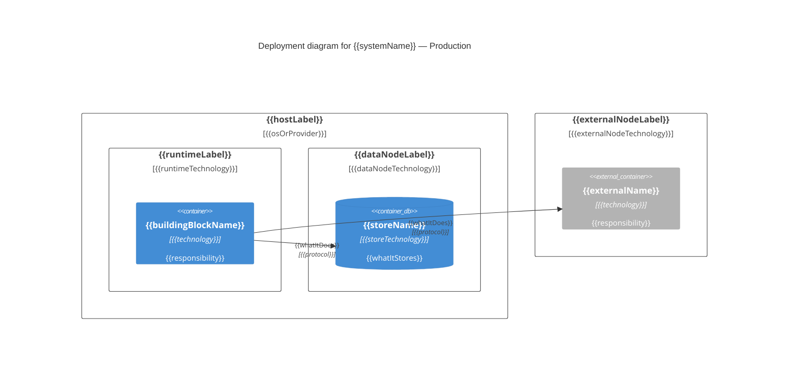

# {{systemName}} Deployment View

<!-- 1-3 sentences: the production hosting model (single VM, Docker Compose host, Kubernetes cluster, managed PaaS), how many nodes, and what fronts it. -->

Building blocks: [ARCHITECTURE.md](./ARCHITECTURE.md). Reference: [Deployment view](https://docs.arc42.org/section-7/).

## Topology

<!-- C4 deployment diagram. Nest Deployment_Node for host → runtime → process; leaves are the Services-table building blocks. C4 is experimental in Mermaid and has no auto-layout — statement order drives placement. Node(...) is the short form of Deployment_Node(...); Node_L/Node_R align left/right. -->

## Nodes

<!-- One subsection per Deployment_Node that hosts something. Exactly one hosting-model block per node — a host running several models nests child nodes instead. Drop the blocks that don't apply. -->

### {{nodeAlias}} — {{nodeLabel}}

<!-- Choose ONE of the four blocks below. -->

#### Virtual machine / bare metal

- **OS:** {{osAndVersion}}
- **Instances:** {{count}} — {{sizingOrRole}}
- **Provisioned by:** {{provisioningMechanism| e.g. Terraform module, Ansible playbook, manual }}
- **Process manager:** {{unitName| e.g. systemd unit app.service }} — {{restartPolicy}}
- **Runs as:** {{userAndGroup}}
- **Listens on:** {{port}}/{{protocol}} — {{boundInterface}}

**Host paths**

<!-- Every path the instance reads or writes. Absolute, with what lives there and whether it survives a redeploy. -->

| Path | Purpose | Owner | Persisted? |
|------|---------|-------|------------|
| `{{path}}` | {{binariesConfigDataLogsSocketsTls}} | {{userAndGroup}} | {{yesOrNo}} |

#### Container (Docker)

- **Image:** `{{registry}}/{{image}}:{{tag}}`
- **Built from:** `{{dockerfilePath}}`
- **Orchestrated by:** `{{composeFilePath}}` — service `{{composeServiceName}}`
- **Published ports:** `{{hostPort}}:{{containerPort}}`
- **Configuration:** {{envAndSecretInjection| e.g. .env file, compose environment:, Docker secret }}
- **Restart policy:** {{restartPolicy}}
- **Healthcheck:** {{healthcheckCommandOrEndpoint}}
- **Resource limits:** {{cpuAndMemoryLimits}}

**Volumes**

<!-- Host paths and named volumes the container mounts — the container equivalent of the VM host-paths table. -->

| Host path or volume | Container path | Mode | Purpose |
|---------------------|----------------|------|---------|
| `{{hostPathOrVolumeName}}` | `{{containerPath}}` | {{roOrRw}} | {{whatLivesThere}} |

#### Orchestrated (Kubernetes and similar)

- **Cluster / namespace:** {{clusterName}} / {{namespace}}
- **Workload:** {{workloadKind| e.g. Deployment, StatefulSet, CronJob }} × {{replicas}}
- **Manifests:** `{{manifestOrChartPath}}`
- **Image:** `{{registry}}/{{image}}:{{tag}}`
- **Exposed via:** {{serviceAndIngress| e.g. ClusterIP Service + Ingress host }}
- **Configuration:** {{configMapsAndSecrets}}
- **Storage:** {{pvcName}} → `{{mountPath}}` ({{accessMode}})
- **Probes:** {{livenessAndReadiness}}
- **Resources:** requests {{requests}}, limits {{limits}}

#### Managed / serverless

- **Service:** {{providerService| e.g. Azure Container Apps, AWS Lambda, Cloud Run }} — {{tierOrPlan}}
- **Region:** {{region}}
- **Deployed by:** {{artifactAndPipeline}}
- **Triggers / bindings:** {{triggersAndBindings}}
- **Identity:** {{identityModel| e.g. managed identity, execution role }}
- **Attached storage:** {{mountedShareOrBucket}} → `{{mountPath}}`
- **Scaling:** {{minInstances}}–{{maxInstances}} on {{scalingSignal}}

## Configuration sources

<!-- How each building block reads its configuration at runtime. Containers differ: one reads only `appsettings.json`, another only environment variables, a third layers both. One subsection per building block whose sources differ from its neighbours; group the ones that share a scheme. -->

### {{mermaidComponentName}} — {{buildingBlockName}}

<!-- Sources in precedence order, lowest first — later rows override earlier ones. Location is the path inside the container/host or the mechanism that injects it. Mark "only source" explicitly when there is exactly one, so a reader doesn't go looking for a file that isn't there. -->

| # | Source | Location | Supplied by | Overrides |
|---|--------|----------|-------------|-----------|
| 1 | {{sourceKind\| e.g. appsettings.json, per-environment appsettings overlay, environment variables, mounted secret file, key vault, command-line args }} | `{{pathOrVariablePrefix}}` | {{whoSuppliesIt\| e.g. baked into the image, compose environment:, ConfigMap, systemd EnvironmentFile }} | {{previousRowOrNone}} |

- **Environment selector:** {{selectorVariable\| e.g. ASPNETCORE_ENVIRONMENT=Production }} — {{whatItSwitches}}
- **Secrets:** {{secretSourceAndInjection}} — never committed; {{whereTheyLand}}
- **Reload behaviour:** {{restartRequiredOrHotReload}}

## Connections

<!-- One row per Rel in the diagram, plus anything reaching the system from outside. -->

| From | To | Protocol | Port | Direction | Auth |
|------|----|----------|------|-----------|------|
| {{fromAlias}} | {{toAlias}} | {{protocol}} | {{port}} | {{oneWayOrBidirectional}} | {{authMechanism}} |

## External dependencies

*(optional)* <!-- Managed data stores, queues, identity providers, and third-party endpoints the system depends on but doesn't deploy. One bullet each: what it is, endpoint or region, and how access is granted. -->

## Operational notes

*(optional)* <!-- Startup order, schema migrations, backup targets and retention, and where logs and metrics land. -->
