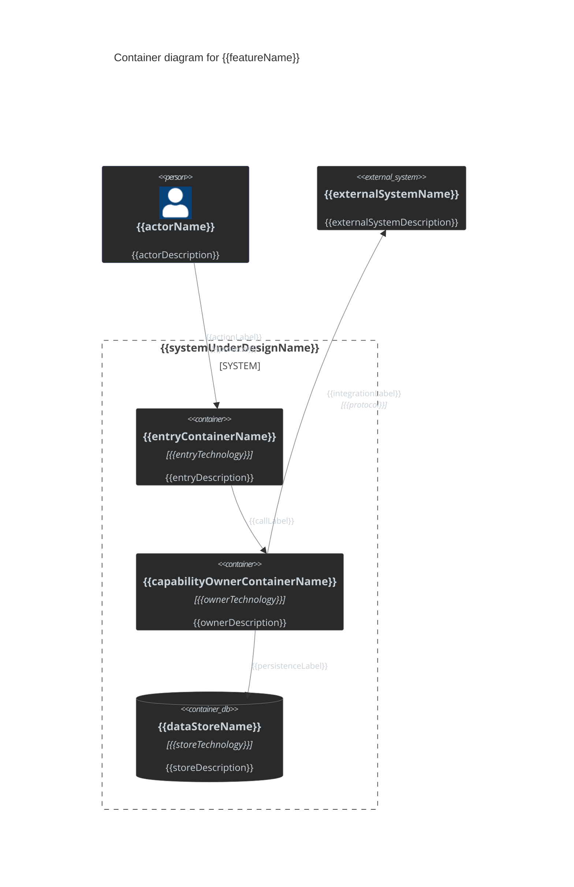

## Solution Diagram

<!-- This is the single required solution-level diagram (design-template.md § Solution Diagram). Render it as a Mermaid `C4Container` diagram, not a `flowchart`. Show containers (deployable/runnable units: GUI, API, service, database, queue) and the actors and external systems around them — not classes, methods, or code-level detail. Delete this instruction. -->

<!-- C4Container element reference:
- `Person(alias, "Label", "Description")` / `Person_Ext(alias, "Label", "Description")` — human actor, internal or external.
- `System(alias, "Label", "Description")` / `System_Ext(alias, "Label", "Description")` — whole system treated as opaque, internal or external.
- `Container(alias, "Label", "Technology", "Description")` — a deployable/runnable unit inside the system under design (web app, API, service, CLI).
- `ContainerDb(alias, "Label", "Technology", "Description")` / `ContainerQueue(alias, "Label", "Technology", "Description")` — a data-store or queue container.
- `Container_Ext(alias, "Label", "Technology", "Description")` — a container owned by an external/other team's system.
- `System_Boundary(alias, "Label") { ... }` / `Container_Boundary(alias, "Label") { ... }` — group containers under the system or a sub-boundary. Use one `System_Boundary` for the system under design; nest at most one level.
- `Rel(from, to, "Label", "Technology")` / `BiRel(from, to, "Label", "Technology")` / `Rel_Back(from, to, "Label", "Technology")` — a call or data flow. `Technology` is optional; omit the trailing arg when not decision-relevant.
- `UpdateElementStyle(alias, $fontColor="...", $bgColor="...", $borderColor="...")` — required per element, to match the repo's dark palette (see gotchas below).
- `UpdateRelStyle(from, to, $textColor="...", $lineColor="...", $offsetX="...", $offsetY="...")` — required per relationship for palette matching; `$offsetX`/`$offsetY` are optional, only to fix label overlap.
-->

<!-- Mermaid technical gotchas for C4Container:
- Every element and boundary needs a unique `alias` (no spaces); the human-readable name goes in the quoted `Label` argument.
- Quote every `Label`, `Description`, and `Technology` argument, even single words — unquoted multi-word text breaks parsing.
- Declare an element once; reference its `alias` in every `Rel`. Do not redeclare inside more than one boundary.
- `Container_Boundary` nests only inside a `System_Boundary` (or another `Container_Boundary`) — it cannot appear at the top level next to `Person`/`System_Ext`.
- Keep relationships pointing in the actual call direction (`Rel(client, server, ...)`); use `BiRel` only for genuinely bidirectional protocols (e.g. websockets), not for request/response pairs.
- C4 has no `classDef`/`:::` and no diagram-wide `themeVariables` (fixed style per upstream docs). Match the repo's dark palette (docs/designs-styles.md) with one `UpdateElementStyle` per element and one `UpdateRelStyle` per `Rel`: `$bgColor="#2a2a2a"`, `$borderColor="#8b949e"`, `$fontColor="#c9d1d9"` for every element except `Person`/`Person_Ext`, which use `$borderColor="#4a5a8a"` to stay distinguishable when the actor icon doesn't render, and `Person_Ext`/`Container_Ext`, which use `$bgColor="#1a1a1a"` (darker grey) to contrast against internal `Person`/`Container`/`ContainerDb` elements' `#2a2a2a`; every `UpdateRelStyle` uses `$textColor="#c9d1d9"`, `$lineColor="#8b949e"`.
-->

Solution Diagram

<!-- Replace every alias, label, technology, and relationship below with the real solution. Add or remove Person/System_Ext/Container/ContainerDb lines and Rel lines to match actual scope; do not keep unused example elements. -->

