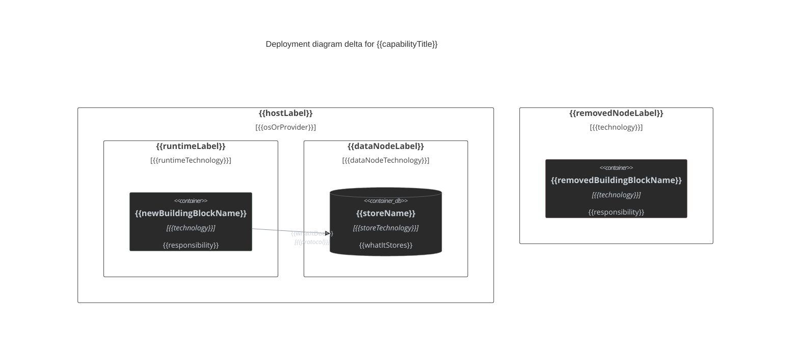

## Deployment View Delta

### {{capabilityTitle}}

<!-- Include only when deployment topology, hosting, or infrastructure node changes are a design decision for this capability. Show decision-relevant nodes and containers, not a full production topology. Delete this instruction. -->

<!-- This diagram shows the deployment DELTA for this capability, not the repo's full production topology: only new, modified, or removed nodes/containers belong here — mark a node or container added (`:::added`), removed (`:::removed`), or unstyled when unchanged and included only to complete a connection to a delta element. There is no `:::memberChanged` equivalent for C4Deployment — describe an in-place node change (e.g. resized instance, new runtime version) in prose under Behaviour changes instead. Delete this instruction. -->

<!-- C4Deployment element reference:
- `Deployment_Node(alias, "Label", "Technology") { ... }` — a host, runtime, or process boundary; nest for host → runtime → process. `Node(...)` is the short form of `Deployment_Node(...)`.
- `Container(alias, "Label", "Technology", "Description")` / `ContainerDb(alias, "Label", "Technology", "Description")` — a deployable/runnable unit or data store hosted inside a `Deployment_Node`, matching a Services-table building block.
- `Container_Ext(alias, "Label", "Technology", "Description")` — a container owned by an external/other team's system, hosted inside its own `Deployment_Node`.
- `Rel(from, to, "Label", "Technology")` — a call or data flow between hosted containers.
Delete this instruction. -->

<!-- Mermaid technical gotchas for C4Deployment (consistent with the class/flowchart delta conventions):
- `C4Deployment` is experimental in Mermaid and has no auto-layout — statement order drives placement; declare a node immediately before the containers it hosts.
- `Deployment_Node` nests host → runtime → process; a leaf `Deployment_Node` hosts `Container`/`ContainerDb` directly, an intermediate one hosts only child `Deployment_Node`s.
- `Node_L`/`Node_R` align a node left/right of its sibling when the default layout collides — use only to fix an overlap, not by default.
- C4 has no `classDef`/`:::` and no diagram-wide `themeVariables` (fixed style per upstream docs) — apply delta styling with `UpdateElementStyle(alias, $fontColor="...", $bgColor="...", $borderColor="...")` per element instead: added elements use `$borderColor="#4a7a5a"`, removed elements use `$borderColor="#8a4a4a"`, unchanged elements use `$borderColor="#8b949e"` — all use `$bgColor="#2a2a2a"`, `$fontColor="#c9d1d9"`. Pair every `Rel` with `UpdateRelStyle(from, to, $textColor="#c9d1d9", $lineColor="#8b949e")`.
- Quote every `Label`, `Description`, and `Technology` argument, even single words — unquoted multi-word text breaks parsing.
Delete this instruction. -->

{{capabilityTitle}}

<!-- Replace every alias, label, technology, and relationship below with the real deployment delta. Add or remove Deployment_Node/Container/ContainerDb/Rel lines to match actual scope; do not keep unused example elements. -->

**Behaviour changes:**
<!-- Omit if this deployment delta has no in-place node change (resized instance, new runtime version, changed scaling policy) beyond what the diagram's added/removed elements already show. -->

- {{changeType| One of (+|-|~)}} {{change| one line}}.

<!-- `added` = solid green border (#4a7a5a), new node/container. `removed` = solid red border (#8a4a4a), deleted node/container. Unstyled (#8b949e border) = unchanged, included only to complete a connection to a delta element. Delete unused example nodes/containers/Rels. -->
