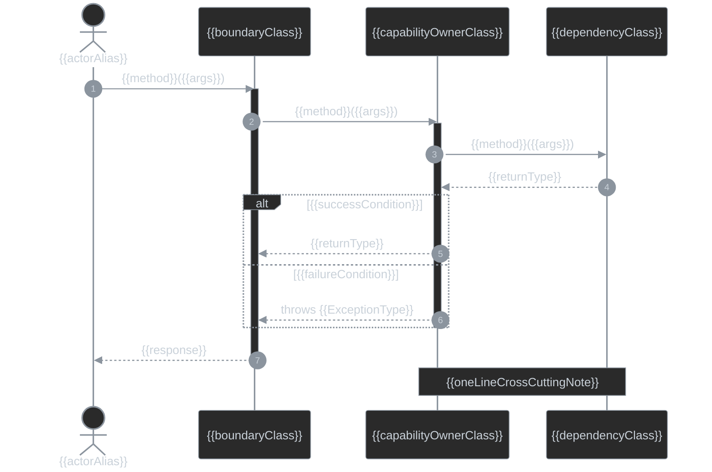

## Sequence Diagrams

### {{capabilityTitle}}

<!-- Include only when interaction order, cross-boundary calls, or failure branching are design decisions for this capability. Show only the lifelines and messages this capability adds or changes — not a full system trace. Delete this instruction. -->

<!-- This diagram shows the interaction DELTA for this capability. Sequence diagrams have no `:::added`/`:::removed` styling mechanism (unlike class/flowchart diagrams), so mark a new or changed step with a `note over` call-out or a leading `NEW:`/`CHANGED:` label in the message text instead. Omit lifelines and messages that are unchanged and not needed to connect the delta. Delete this instruction. -->

<!-- Mermaid technical gotchas (verified against `mmdc` 11.16.0):
- `actor` renders a stick figure and is reserved for the human/external initiator; `participant` renders a box for a system component. Use `participant X as ClassName` to alias a short lifeline id to the real class name.
- Solid arrow with filled head (`->>`) is a synchronous call; dashed arrow with filled head (`-->>`) is its return. Pair every `->>` with a matching `-->>` from the same target — an unpaired call reads as fire-and-forget.
- `activate`/`deactivate` (or `+`/`-` shorthand on the arrow) draws the activation bar; nest them to show a call still on the stack while it waits on a downstream call.
- `alt`/`else`/`end` branches mutually exclusive outcomes (e.g. success vs. failure). Use `opt`/`end` instead when there is only one conditional branch with no alternative.
- `note over A,B: text` spans a free-text note across two lifelines for a cross-cutting concern that doesn't belong on a single arrow.
- A literal `;` anywhere in message or note text is parsed as a statement terminator and breaks the parser (`Expecting ... got 'NEWLINE'`). Use `-` or `,` instead of `;` in arrow/note text.
Delete this instruction. -->

<!-- `autonumber` is mandatory — it numbers every step so review comments and prose can reference a step by number. Keep it as the first line under `sequenceDiagram`. Delete this instruction. -->

{{capabilityTitle}}

<!-- The `themeVariables` block reuses the class diagram's dark palette per property since sequence diagrams have no `classDef`: `#2a2a2a` fill, `#8b949e` stroke/line, `#c9d1d9` text. `note over A,B` is optional — add it only for a short cross-cutting explanation. Delete unused example lifelines/messages/notes. -->
