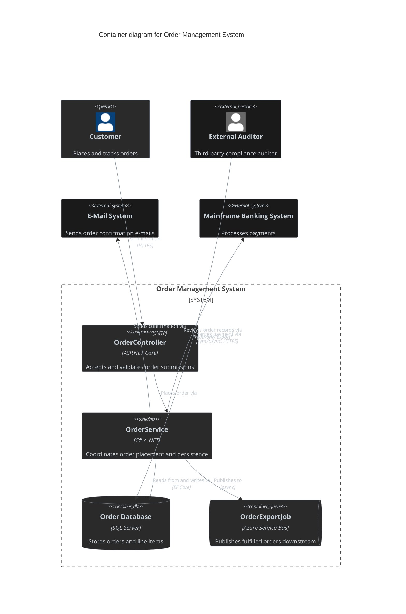

## Solution Diagram Example

Solution Diagram — Order Management System

```mermaid
C4Container
    title Container diagram for Order Management System

    Person(customer, "Customer", "Places and tracks orders")
    Person_Ext(auditor, "External Auditor", "Third-party compliance auditor")
    System_Ext(email_system, "E-Mail System", "Sends order confirmation e-mails")
    System_Ext(mainframe, "Mainframe Banking System", "Processes payments")

    System_Boundary(system, "Order Management System") {
        Container(api, "OrderController", "ASP.NET Core", "Accepts and validates order submissions")
        Container(svc, "OrderService", "C# / .NET", "Coordinates order placement and persistence")
        ContainerDb(db, "Order Database", "SQL Server", "Stores orders and line items")
        ContainerQueue(queue, "OrderExportJob", "Azure Service Bus", "Publishes fulfilled orders downstream")
    }

    Rel(customer, api, "Submits order", "HTTPS")
    Rel(api, svc, "Places order via")
    Rel(svc, db, "Reads from and writes to", "EF Core")
    Rel(svc, queue, "Publishes to", "async")
    Rel(svc, mainframe, "Charges payment via", "sync/async, HTTPS")
    Rel(svc, email_system, "Sends confirmation via", "SMTP")
    Rel(auditor, db, "Reviews order records via", "read-only export")

    UpdateElementStyle(customer, $fontColor="#c9d1d9", $bgColor="#2a2a2a", $borderColor="#4a5a8a")
    UpdateElementStyle(auditor, $fontColor="#c9d1d9", $bgColor="#1a1a1a", $borderColor="#4a5a8a")
    UpdateElementStyle(api, $fontColor="#c9d1d9", $bgColor="#2a2a2a", $borderColor="#8b949e")
    UpdateElementStyle(svc, $fontColor="#c9d1d9", $bgColor="#2a2a2a", $borderColor="#8b949e")
    UpdateElementStyle(db, $fontColor="#c9d1d9", $bgColor="#2a2a2a", $borderColor="#8b949e")
    UpdateElementStyle(queue, $fontColor="#c9d1d9", $bgColor="#2a2a2a", $borderColor="#8b949e")
    UpdateElementStyle(email_system, $fontColor="#c9d1d9", $bgColor="#1a1a1a", $borderColor="#8b949e")
    UpdateElementStyle(mainframe, $fontColor="#c9d1d9", $bgColor="#1a1a1a", $borderColor="#8b949e")
    UpdateRelStyle(customer, api, $textColor="#c9d1d9", $lineColor="#8b949e", $offsetY="-10")
    UpdateRelStyle(api, svc, $textColor="#c9d1d9", $lineColor="#8b949e")
    UpdateRelStyle(svc, db, $textColor="#c9d1d9", $lineColor="#8b949e")
    UpdateRelStyle(svc, queue, $textColor="#c9d1d9", $lineColor="#8b949e")
    UpdateRelStyle(svc, mainframe, $textColor="#c9d1d9", $lineColor="#8b949e", $offsetY="20", $offsetX="-30")
    UpdateRelStyle(svc, email_system, $textColor="#c9d1d9", $lineColor="#8b949e")
    UpdateRelStyle(auditor, db, $textColor="#c9d1d9", $lineColor="#8b949e")
```

