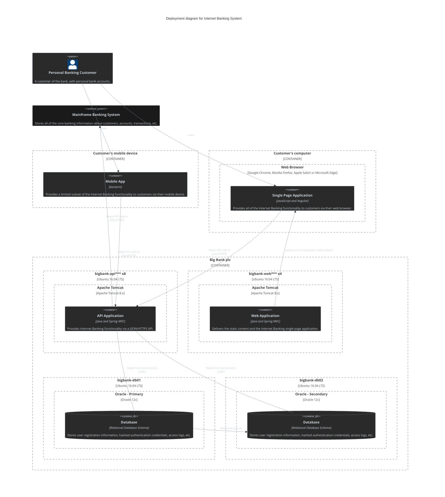

## Deployment View Example

Internet Banking Deployment Topology

```mermaid
C4Container
    title Deployment diagram for Internet Banking System

    Person(customer, "Personal Banking Customer", "A customer of the bank, with personal bank accounts.")
    System_Ext(mainframe, "Mainframe Banking System", "Stores all of the core banking information about customers, accounts, transactions, etc.")

    Container_Boundary(mob, "Customer's mobile device", "Apple iOS or Android") {
        Container(mobile, "Mobile App", "Xamarin", "Provides a limited subset of the Internet Banking functionality to customers via their mobile device.")
    }

    Container_Boundary(comp, "Customer's computer", "Microsoft Windows or Apple macOS") {
        Boundary(browser, "Web Browser", "Google Chrome, Mozilla Firefox, Apple Safari or Microsoft Edge") {
            Container(spa, "Single Page Application", "JavaScript and Angular", "Provides all of the Internet Banking functionality to customers via their web browser.")
        }
    }

    Container_Boundary(plc, "Big Bank plc", "Big Bank plc data center") {
        Boundary(dn, "bigbank-api*** x8", "Ubuntu 16.04 LTS") {
            Boundary(apache, "Apache Tomcat", "Apache Tomcat 8.x") {
                Container(api, "API Application", "Java and Spring MVC", "Provides Internet Banking functionality via a JSON/HTTPS API.")
            }
        }
        Boundary(bb2, "bigbank-web*** x4", "Ubuntu 16.04 LTS") {
            Boundary(apache2, "Apache Tomcat", "Apache Tomcat 8.x") {
                Container(web, "Web Application", "Java and Spring MVC", "Delivers the static content and the Internet Banking single page application.")
            }
        }
        Boundary(bigbankdb01, "bigbank-db01", "Ubuntu 16.04 LTS") {
            Boundary(oracle, "Oracle - Primary", "Oracle 12c") {
                ContainerDb(db, "Database", "Relational Database Schema", "Stores user registration information, hashed authentication credentials, access logs, etc.")
            }
        }
        Boundary(bigbankdb02, "bigbank-db02", "Ubuntu 16.04 LTS") {
            Boundary(oracle2, "Oracle - Secondary", "Oracle 12c") {
                ContainerDb(db2, "Database", "Relational Database Schema", "Stores user registration information, hashed authentication credentials, access logs, etc.")
            }
        }
    }

    Rel(customer, mobile, "Uses")
    Rel(customer, spa, "Uses")
    Rel(mobile, api, "Makes API calls to", "json/HTTPS")
    Rel(spa, api, "Makes API calls to", "json/HTTPS")
    Rel_U(web, spa, "Delivers to the customer's web browser")
    Rel(api, db, "Reads from and writes to", "JDBC")
    Rel(api, db2, "Reads from and writes to", "JDBC")
    Rel_R(db, db2, "Replicates data to")
    Rel(api, mainframe, "Makes API calls to", "XML/HTTPS")

    UpdateElementStyle(customer, $fontColor="#c9d1d9", $bgColor="#2a2a2a", $borderColor="#4a5a8a")
    UpdateElementStyle(mobile, $fontColor="#c9d1d9", $bgColor="#2a2a2a", $borderColor="#4a7a5a")
    UpdateElementStyle(spa, $fontColor="#c9d1d9", $bgColor="#2a2a2a", $borderColor="#8b949e")
    UpdateElementStyle(api, $fontColor="#c9d1d9", $bgColor="#2a2a2a", $borderColor="#8b949e")
    UpdateElementStyle(web, $fontColor="#c9d1d9", $bgColor="#2a2a2a", $borderColor="#8b949e")
    UpdateElementStyle(db, $fontColor="#c9d1d9", $bgColor="#2a2a2a", $borderColor="#8b949e")
    UpdateElementStyle(db2, $fontColor="#c9d1d9", $bgColor="#2a2a2a", $borderColor="#8b949e")
    UpdateElementStyle(mainframe, $fontColor="#c9d1d9", $bgColor="#1a1a1a", $borderColor="#8b949e")

    UpdateRelStyle(customer, mobile, $textColor="#c9d1d9", $lineColor="#8b949e")
    UpdateRelStyle(customer, spa, $textColor="#c9d1d9", $lineColor="#8b949e")
    UpdateRelStyle(mobile, api, $textColor="#c9d1d9", $lineColor="#8b949e")
    UpdateRelStyle(spa, api, $textColor="#c9d1d9", $lineColor="#8b949e", $offsetY="-40")
    UpdateRelStyle(web, spa, $textColor="#c9d1d9", $lineColor="#8b949e", $offsetY="-40")
    UpdateRelStyle(api, db, $textColor="#c9d1d9", $lineColor="#8b949e", $offsetY="-20", $offsetX="5")
    UpdateRelStyle(api, db2, $textColor="#c9d1d9", $lineColor="#8b949e", $offsetX="-40", $offsetY="-20")
    UpdateRelStyle(db, db2, $textColor="#c9d1d9", $lineColor="#8b949e", $offsetY="-10")
    UpdateRelStyle(api, mainframe, $textColor="#c9d1d9", $lineColor="#8b949e")
```

