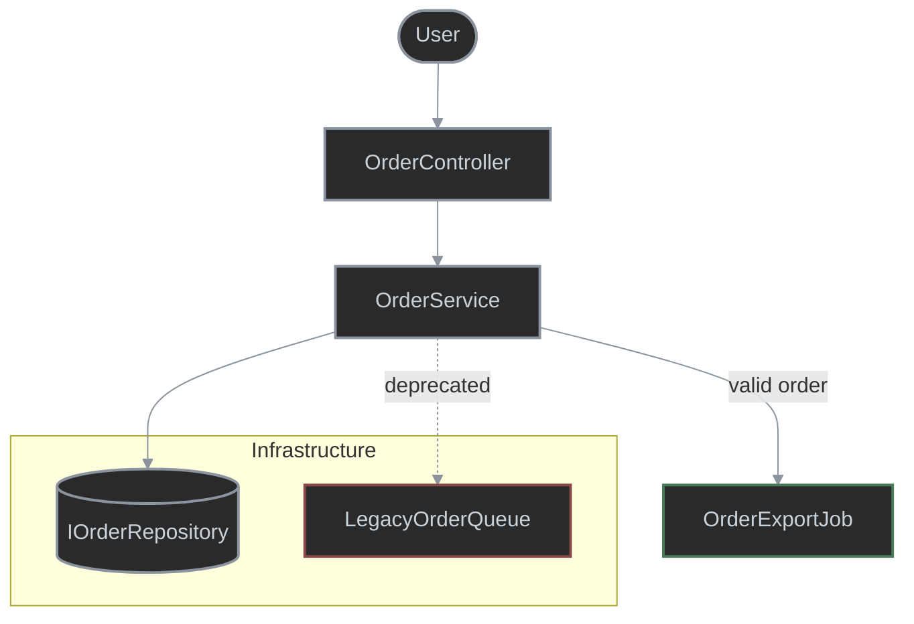

## Flowchart Example

Order Processing Flowchart

```mermaid
%%{init: {'themeVariables': {'lineColor': '#8b949e'}}}%%
flowchart TD
    User(["User"])
    Api["OrderController"]
    Svc["OrderService"]
    Repo[("IOrderRepository")]
    Queue["OrderExportJob"]:::added
    Legacy["LegacyOrderQueue"]:::removed

    User --> Api
    Api --> Svc
    Svc --> Repo
    Svc -- valid order --> Queue
    Svc -. deprecated .-> Legacy

    subgraph Infrastructure
        Repo
        Legacy
    end

    classDef default fill:#2a2a2a,stroke:#8b949e,color:#c9d1d9,stroke-width:2px
    classDef added stroke:#4a7a5a,stroke-width:2px
    classDef removed stroke:#8a4a4a,stroke-width:2px
```

