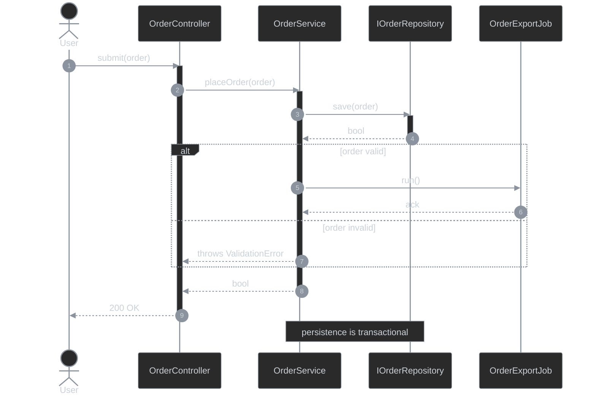

## Sequence Diagram Example

Order Submission Sequence

```mermaid
%%{init: {'themeVariables': {
    'lineColor': '#8b949e',
    'actorBkg': '#2a2a2a', 'actorBorder': '#8b949e', 'actorTextColor': '#c9d1d9', 'actorLineColor': '#8b949e',
    'signalColor': '#8b949e', 'signalTextColor': '#c9d1d9',
    'labelBoxBkgColor': '#2a2a2a', 'labelBoxBorderColor': '#8b949e', 'labelTextColor': '#c9d1d9',
    'loopTextColor': '#c9d1d9',
    'noteBkgColor': '#2a2a2a', 'noteBorderColor': '#8b949e', 'noteTextColor': '#c9d1d9',
    'activationBorderColor': '#8b949e', 'activationBkgColor': '#2a2a2a',
    'sequenceNumberColor': '#c9d1d9'
}}}%%
sequenceDiagram
    autonumber
    actor User
    participant Api as OrderController
    participant Svc as OrderService
    participant Repo as IOrderRepository
    participant Queue as OrderExportJob

    User->>Api: submit(order)
    activate Api
    Api->>Svc: placeOrder(order)
    activate Svc
    Svc->>Repo: save(order)
    activate Repo
    Repo-->>Svc: bool
    deactivate Repo
    alt order valid
        Svc->>Queue: run()
        Queue-->>Svc: ack
    else order invalid
        Svc-->>Api: throws ValidationError
    end
    Svc-->>Api: bool
    deactivate Svc
    Api-->>User: 200 OK
    deactivate Api

    note over Svc,Repo: persistence is transactional
```

