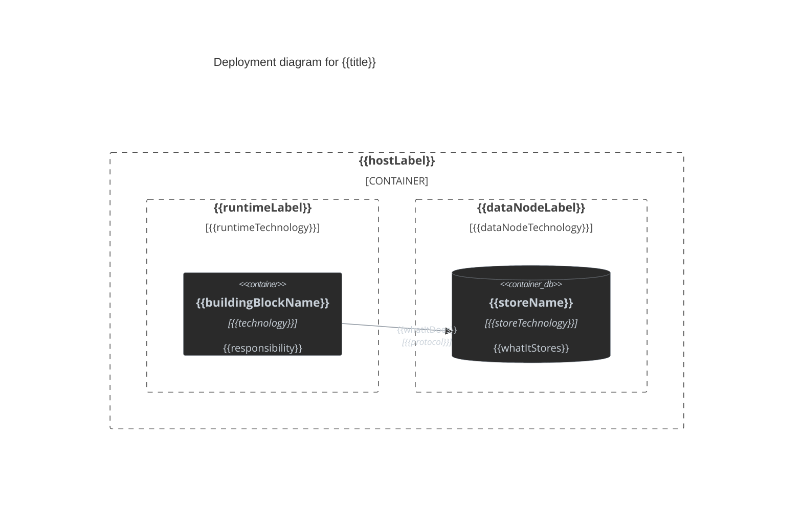

## Deployment View

### {{title}}

<!-- Include only when deployment topology, hosting, or infrastructure nodes are a design decision. Show decision-relevant nodes and containers, not a full production topology. Delete this instruction. -->

<!-- Modeled as C4Container, not C4Deployment: `C4Deployment` cannot be palette-matched consistently with the rest of this repo's diagrams, so every top-level deployment host becomes a `Container_Boundary` and every nested host/runtime becomes a generic `Boundary` inside it — same pattern as docs/design-styles reference "C4 Deployment view, modeled as C4Container". Delete this instruction. -->

<!-- C4Container element reference (deployment usage):
- `Container_Boundary(alias, "Label") { ... }` — a top-level deployment host (device, machine, data center). Only top-level hosts use this.
- `Boundary(alias, "Label", "Technology") { ... }` — a nested host/runtime/process inside a `Container_Boundary` or another `Boundary` (e.g. web browser, Apache Tomcat, OS); the `Technology` arg carries what would otherwise be `Deployment_Node`'s type string.
- `Container(alias, "Label", "Technology", "Description")` / `ContainerDb(alias, "Label", "Technology", "Description")` — a deployable/runnable unit or data store hosted inside a `Boundary`, matching a Services-table building block.
- `Container_Ext(alias, "Label", "Technology", "Description")` — a container owned by an external/other team's system, hosted inside its own `Container_Boundary`.
- `Rel(from, to, "Label", "Technology")` — a call or data flow between hosted containers.
Delete this instruction. -->

<!-- Mermaid technical gotchas for C4Container-as-deployment (consistent with the class/flowchart conventions):
- No auto-layout — statement order drives placement; declare a boundary immediately before the containers it hosts.
- `Container_Boundary` only nests inside `C4Container`'s top level; every host beneath it (however many levels deep) uses the generic `Boundary`, since `Boundary` can nest inside `Boundary`.
- `Rel_L`/`Rel_R`/`Rel_U`/`Rel_D` bias an edge's layout direction when the default collides — use only to fix an overlap, not by default.
- C4 has no `classDef`/`:::` and no diagram-wide `themeVariables` (fixed style per upstream docs) — apply per-element styling with `UpdateElementStyle(alias, $fontColor="...", $bgColor="...", $borderColor="...")`: `$bgColor="#2a2a2a"`, `$borderColor="#8b949e"`, `$fontColor="#c9d1d9"` for every element, except `Container_Ext` elements, which use `$bgColor="#1a1a1a"` (darker grey) to contrast against internal `Container`/`ContainerDb` elements. Pair every `Rel` with `UpdateRelStyle(from, to, $textColor="#c9d1d9", $lineColor="#8b949e")`.
- Quote every `Label`, `Description`, and `Technology` argument, even single words — unquoted multi-word text breaks parsing.
Delete this instruction. -->

{{title}}

<!-- Replace every alias, label, technology, and relationship below with the real deployment topology. Add or remove Container_Boundary/Boundary/Container/ContainerDb/Rel lines to match actual scope; do not keep unused example elements. -->

<!-- Delete unused example nodes/containers/Rels. -->
