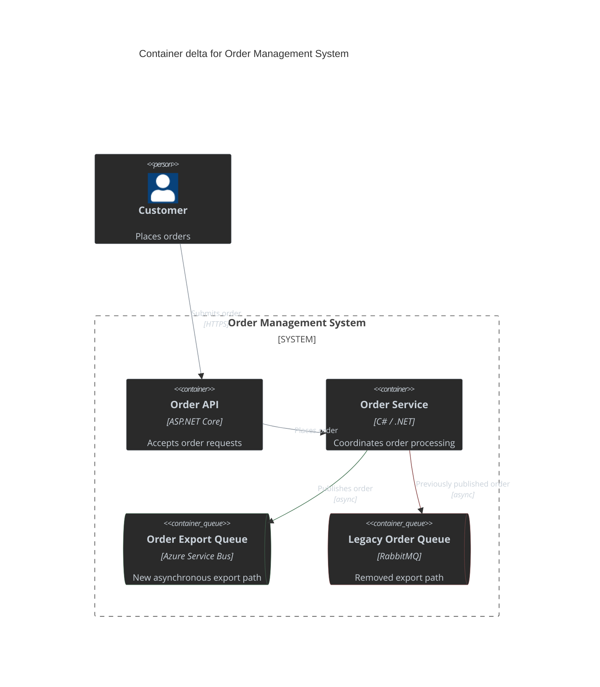

## Container Diagram Delta Example

Order Management System — Container Delta

**Behaviour changes**
- `+` Order Export Queue replaces the legacy export path.
- `-` Legacy Order Queue is removed.
- `~` Order Service publishes exports through Azure Service Bus.
