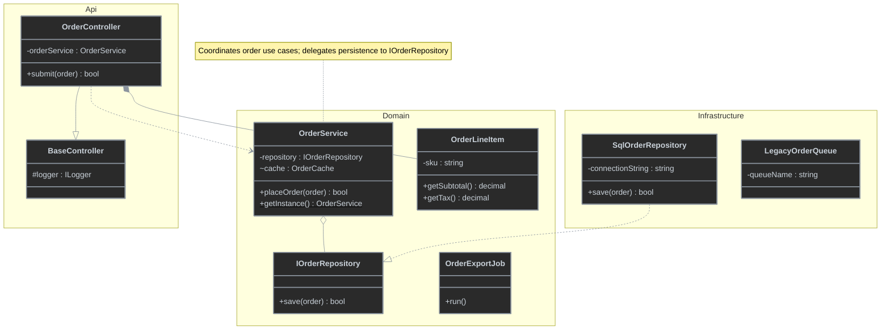

## Class Diagram Example

Order Management Domain Classes

```mermaid
%%{init: {'themeVariables': {'lineColor': '#8b949e'}}}%%
classDiagram
    namespace Api {
        class BaseController {
            #logger : ILogger
        }
        class OrderController {
            -orderService : OrderService
            +submit(order) bool
        }
    }
    namespace Domain {
        class OrderService {
            -repository : IOrderRepository
            ~cache : OrderCache
            +placeOrder(order) bool
            +getInstance() OrderService$
        }
        class OrderLineItem {
            -sku : string
            +getSubtotal() decimal
            +getTax() decimal
        }
        class IOrderRepository {
            +save(order) bool
        }
        class OrderExportJob {
            +run()
        }
    }
    namespace Infrastructure {
        class SqlOrderRepository {
            -connectionString : string
            +save(order) bool
        }
        class LegacyOrderQueue {
            -queueName : string
        }
    }

    OrderController --|> BaseController
    OrderController *-- OrderLineItem
    OrderService o-- IOrderRepository
    SqlOrderRepository ..|> IOrderRepository
    OrderController ..> OrderService

    note for OrderService "Coordinates order use cases; delegates persistence to IOrderRepository"

    classDef default fill:#2a2a2a,stroke:#8b949e,color:#c9d1d9,stroke-width:2px
```

