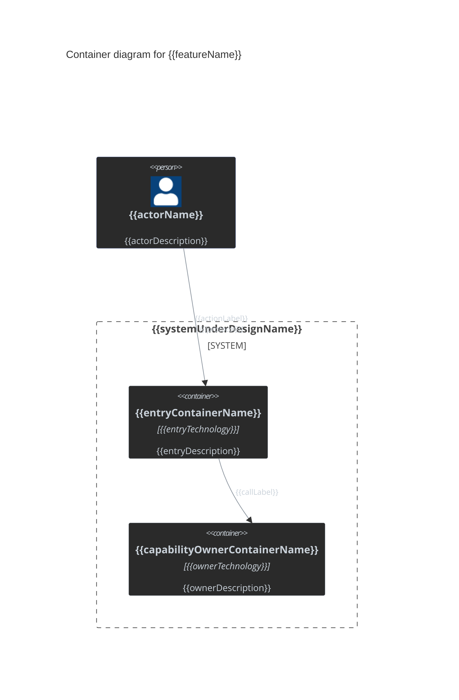
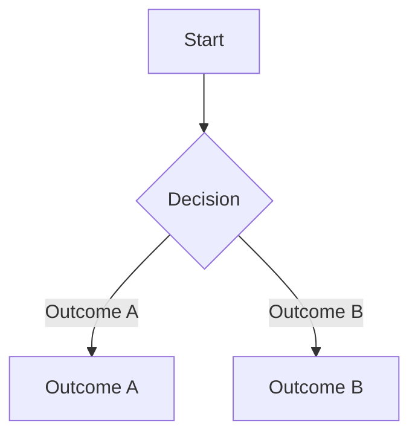
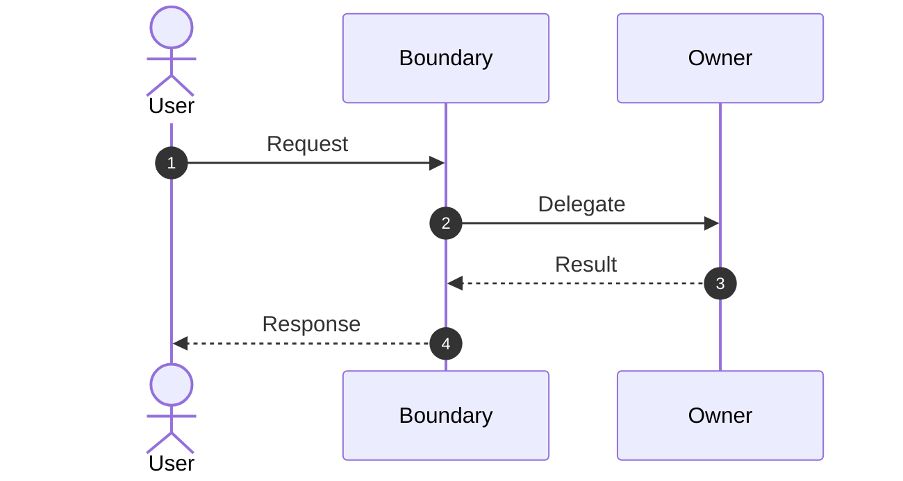

# Design Output Template

Instantiate this template at `docs/designs/{{featureSlug}}.md`. Remove every hidden instruction from the populated document.

````markdown
# {{featureName}}

<!-- The epic link (JIRA) in format [jira item id: title](link). -->

<details>
<summary>Reviewers</summary>

| **Role** | **Name** |
| --- | --- |
| Author (Feature Lead) | |
| Reviewers (Architect \ TL) | |
| PO | |
</details>

<!-- confluence:toc -->

# Problem Statement and Goals

<!-- Detail the motivation for the change, the issue or enhancement being addressed, and its business context. The PO must review and approve this section. -->

{{problemAndGoals}}

# Requirements

<!-- Keep this section fully synchronized with the PO. Make every requirement clear and self-explanatory; Distinguish product requirements from technical requirements, and obtain PO approval for requirements from the development team. Use one row per capability, with its stakeholder requirement and functional requirements in the Details column. Row numbers express capability order. Source is the requirement category (PO / Dev team), not source provenance. -->

<!-- confluence:wide-table -->
| **#** | **Requirement** | **Priority** | **Details** | **Source** |
| --- | --- | --- | --- | --- |
|  | {{capabilityTitle\|behavior + entity}} | {{priority\|MVP / Should have / Nice to have}} | {{stakeholderRequirement\|The actor needs to perform behavior on an entity, so value is achieved.}}<br>- {{functionalRequirement\|behavior when condition}}<br>- {{functionalRequirement\|behavior when condition}}<br>- {{businessRules\|State invariants, or None.}}<br>- {{edgeCases\|Boundary handling, or None.}} | {{requirementSource\|PO / Dev team}} |
|  | {{nextCapabilityTitle\|behavior + entity}} | {{priority\|MVP / Should have / Nice to have}} | {{stakeholderRequirement\|The actor needs to perform behavior on an entity, so value is achieved.}}<br>- {{functionalRequirement\|behavior when condition}}<br>- {{functionalRequirement\|behavior when condition}}<br>- {{businessRules\|State invariants, or None.}}<br>- {{edgeCases\|Boundary handling, or None.}} | {{requirementSource\|PO / Dev team}} |

# Assumptions and Limitations

<!-- List limitations: requirements the solution cannot meet because of constraints or drawbacks, such as high memory consumption or uncovered use cases. List assumptions: criteria that must be fully met for the solution to remain valid. -->

{{assumptionsAndLimitations}}

# Out of Scope

<!-- List items the proposed solution does not address but that the PO or other stakeholders might reasonably assume are included. -->

{{outOfScope}}

# Glossary and Abbreviations

<details>
<summary>Glossary and Abbreviations</summary>

| **Term** | **Description** |
| --- | --- |
| {{term}} | {{description}} |

</details>

# Current State

<!-- Include the section only on user demand, otherwise remove section completely. if applicable, describe and diagram the application, component, or code area before the change. Visually distinguish components that this solution can change. -->

<details>
<summary>Current State</summary>

{{currentState}}

</details>

# Solution Overview

<!-- Outline the planned solution to the problem presented in the epic. This is the main content for the design meeting and should not exceed eight pages as a best practice. -->

{{architectureLevelSolution}}

## Use cases

<!-- Describe where the user interacts with the feature and under what circumstances, such as install, create, upgrade, or undo operations. -->

- {{actor}} {{usesCapability}} when {{circumstance}}.

## Solution Diagram

<!-- Read templates/c4-container-diagram-template.md for the full element reference and mermaid gotchas. Exactly one solution-level C4Container diagram is required, showing containers (deployable/runnable units) and the actors/external systems around them — not classes or flow steps. -->

<details>
<summary>Solution Diagram</summary>


</details>

## Flow Diagram: {{flowTitle}}

<details>
<summary>Flow Diagram: {{flowTitle}}</summary>

<!-- Use a flow diagram to visualize the step-by-step process, workflow, and decisions. Include additional diagrams when needed. This section is optional; include it only for a materially distinct decision path. -->


</details>

## Sequence Diagram: {{sequenceTitle}}

<details>
<summary>Sequence Diagram: {{sequenceTitle}}</summary>

<!-- Use a sequence diagram to show high-level interaction between components, citizen classes, or IDesign-style classes (Manager, Engine, Accessor) over time to complete a scenario. Omit method-level and low-level implementation detail — that belongs in Detailed Design: Implementation Appendix. Include additional diagrams when needed. This section is optional; include it only for a materially distinct cross-component interaction. -->

<!-- `autonumber` is mandatory — it numbers every step so review comments and prose can reference a step by number. Keep it as the first line under `sequenceDiagram`. Delete this instruction. -->


</details>

## Decisions

<!-- {{decisionTitle}} names the overall design choice. {{decisionDescription}} gives its context and rationale. Each {{decisionName}} names one supporting implementation decision in the bullet list. -->

### {{decisionTitle}}

{{decisionDescription}}

- **{{decisionName}}:** {{decision and rationale}}

# Testing Guidelines

<details>
<summary>Testing Guidelines</summary>

## Testing by Dev

<!-- Describe the development team's manual and automated testing, including unit, integration, and end-to-end coverage. -->

{{unitIntegrationAndEndToEndCoverage}}

## QA Testing Focus Areas

<!-- Identify QA focus areas and regression areas. If testing can proceed incrementally through mocks, integrations, or other methods, explain the testing stages. -->

{{qaFocusAndRegressionAreas}}

## Scale

<!-- Define scale-testing requirements and whether the feature can affect memory consumption, RPO/RTO, or system performance. Include concrete scenarios, quantities, thresholds, and test types such as protected and unprotected VM counts, hosts, volumes, and I/O rate. State whether QA scale regression and feature-specific scale testing are required. -->

{{scaleScenariosAndThresholds}}

</details>

# Backward Compatibility

<details>
<summary>Backward Compatibility</summary>

<!-- Describe backward compatibility, whether the feature must be tested against previous versions, and any special compatibility considerations. -->

{{backwardCompatibility}}

</details>

# Upgrade Considerations

<details>
<summary>Upgrade Considerations</summary>

<!-- Describe how the feature affects upgrades, including new or changed database schemas and removed components. -->

{{upgradeConsiderations}}

</details>

# Platforms

<details>
<summary>Platforms</summary>

<!-- List supported platforms, such as VC, VCD, AWS, Azure, AVS, SCVMM, VME, and GCVe. -->

{{supportedPlatforms}}

### Public Cloud Cost Estimation

<!-- Estimate public-cloud development costs in $500 increments to support planning and avoid unexpected charges. Include compute, storage, and other hidden costs; round a lower estimate up to the applicable $500 increment. -->

{{costEstimateInFiveHundredDollarIncrements}}

</details>

# Feature Flag

<details>
<summary>Feature Flag</summary>

<!-- Contains the decision if the functionality will be disabled using the feature flag or tweak.  -->
<!-- If configuration tweaks added, modified, deleted during the design, add the table with the columns (Tweak name, Default, Description) -->

{{featureFlagAndReason}}

</details>

# Open Questions

<details>
<summary>Open Questions</summary>

<!-- List unresolved questions when applicable. -->

| **Question** | **Answer**  |
| --- | --- |
| {{unresolvedDecisionOrConflict}} |  |

</details>

# Detailed Design: Implementation Appendix
<!-- Insert zero or more complete appendix templates in this order:  GUI Design Delta, REST API Delta, Database Schema Delta, Class Diagram. Remove this comment and the placeholder when none apply. -->

{{implementationAppendices}}

# Checklists

<details>
<summary>Checklists</summary>

<!-- For each row, keep only the correct value (applicable / not applicable) and fill in details in the empty box if relevant. Remove a subsection only when the whole category is not applicable, and note that in Details. -->

## Main Workflows

| **Item** | **Applicable** | **Details** |
| --- | --- | --- |
| VPG Workflows | {{applicable / not applicable}} |  |
| VRA Workflows | {{applicable / not applicable}} |  |
| Undo | {{applicable / not applicable}} |  |

## Interfaces & Operations

| **Item** | **Applicable** | **Details** |
| --- | --- | --- |
| Alerts / Events / Tasks | {{applicable / not applicable}} |  |
| API | {{applicable / not applicable}} |  |

## Resiliency

| **Item** | **Applicable** | **Details** |
| --- | --- | --- |
| ZVM Restart | {{applicable / not applicable}} |  |
| VRA Restart | {{applicable / not applicable}} |  |
| Network Disconnections | {{applicable / not applicable}} |  |
| Locking, Synchronization | {{applicable / not applicable}} |  |

## Supportability

| **Item** | **Applicable** | **Details** |
| --- | --- | --- |
| Analytics (CallHome, Transmitter, Google Analytics) | {{applicable / not applicable}} |  |
| Tweaks | {{applicable / not applicable}} |  |
| Log Collection | {{applicable / not applicable}} |  |
| Log Parser | {{applicable / not applicable}} |  |

## Security

| **Item** | **Applicable** | **Details** |
| --- | --- | --- |
| STRIDE analysis, Passwords, Data Validations | {{applicable / not applicable}} |  |
| Authentication, Authorization | {{applicable / not applicable}} |  |
| New endpoints created and their security features | {{applicable / not applicable}} |  |
| Used unauthenticated endpoints | {{applicable / not applicable}} |  |
| Used unencrypted endpoints | {{applicable / not applicable}} |  |
| New server endpoints | {{applicable / not applicable}} |  |
| New secrets (incl. new places for existing secrets) | {{applicable / not applicable}} |  |
| FIPS compliance | {{applicable / not applicable}} |  |

## Containers \\ Appliance Changes

| **Item** | **Applicable** | **Details** |
| --- | --- | --- |
| Was new container added? [New Container Checklist](https://zerto.atlassian.net/wiki/spaces/ZA/pages/2241921025) | {{applicable / not applicable}} |  |
| New container expected resources (storage, CPU, Memory) | {{applicable / not applicable}} |  |
| Any other appliance related changes | {{applicable / not applicable}} |  |

## 3rd Party & Open Source Review & Deliverables

<!-- If a new third-party resource is used, list it here. You may exclude Microsoft and .NET default NuGets (System.* or Microsoft.*). Include relevant open-source projects even if already OSRB-approved elsewhere. -->

| **Component** | **Version** | **License** | **URL** | **Usage** |
| --- | --- | --- | --- | --- |
|  |  |  |  |  |

## External Deliverables Change

<!-- If any of the below applies to your work, state it clearly and ensure everything is delivered, updated, and acknowledged, handing it over as necessary. -->

| **Item** | **Applicable** | **Details** |
| --- | --- | --- |
| Requires Change to Documentation? | {{applicable / not applicable}} |  |
| Requires or affects Swagger? Was this executed? | {{applicable / not applicable}} |  |
| New Permissions or change in policies? | {{applicable / not applicable}} |  |
| Involves scripts or anything that isn't part of the binaries of the application? | {{applicable / not applicable}} |  |

</details>
````
<!-- confluence:ignore:start -->

# Source Material

<!-- Record each consumed source once. Use a repository-relative path or canonical issue URL. Update the matching row when reprocessing a source. Do not infer provenance for legacy content. -->

| **Source** | **Kind** | **Contribution** |
| --- | --- | --- |
| {{canonicalSource}} | {{sourceKind|Spec / GitHub issue / Wayfinder map / Wayfinder decision / Wayfinder evidence / Grill conversation}} | {{consumedEvidence}} |
<!-- confluence:ignore:end -->

