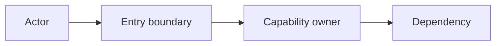
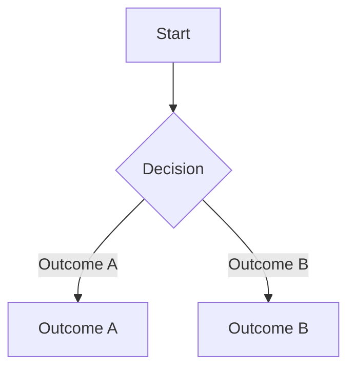
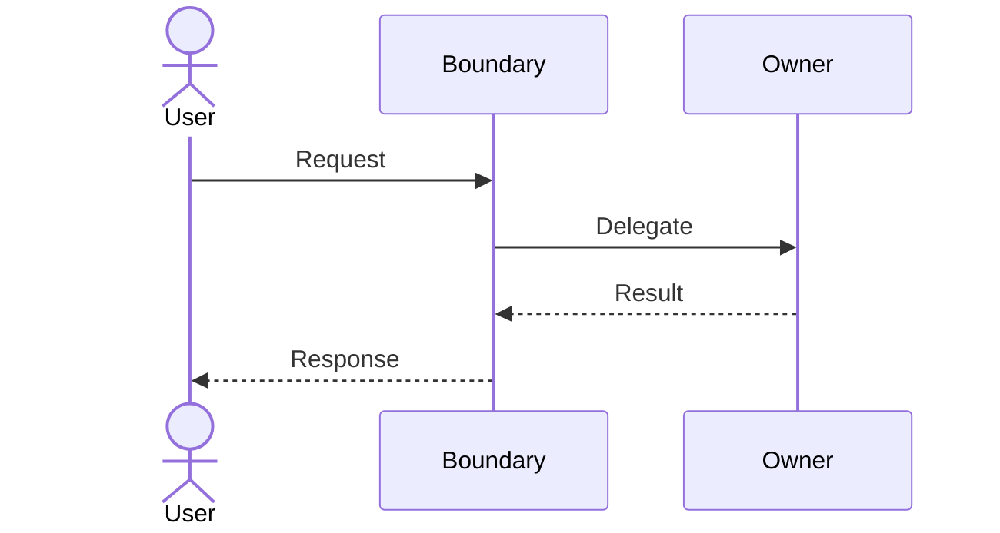

# Design Output Template

Instantiate this template at `docs/designs/{{featureSlug}}.md`. Remove every hidden instruction from the populated document.

````markdown
# {{featureName}}

<!-- Include the feature name and epic link (JIRA). -->

# Table of Contents

{{tableOfContents}}

# Problem Statement and Goals

<!-- Detail the motivation for the change, the issue or enhancement being addressed, and its business context. The PO must review and approve this section. -->

{{problemAndGoals}}

# Requirements

<!-- Keep this section fully synchronized with the PO. Make every requirement clear and self-explanatory; use Details only for needed clarification. Distinguish product requirements from technical requirements, and obtain PO approval for requirements from the development team. Use one row per capability, with its stakeholder requirement and functional requirements in the Requirement cell. Row numbers express document hierarchy, not capability IDs. Source is the requirement category (PO / Dev team), not source provenance. -->

| **#** | **Requirement** | **Priority** | **Details** | **Source** |
| --- | --- | --- | --- | --- |
|   | **{{capabilityTitle|behavior + entity}}**<br>**Stakeholder requirement:** The {{actor}} needs to {{behavior}} {{entity}}, so {{value}}.<br>- {{functionalRequirement|behavior when condition}}<br>- {{functionalRequirement|behavior when condition}} | {{priority|MVP / Should have / Nice to have}} | **Risk:** {{risk|Low / Medium / High}}. **Business rules:** {{businessRules|State invariants, or None.}} **Edge cases:** {{edgeCases|State boundary handling, or None.}} | {{requirementSource|PO / Dev team}} |
|   | **{{nextCapabilityTitle|behavior + entity}}**<br>**Stakeholder requirement:** {{stakeholderRequirement}} | {{priority|MVP / Should have / Nice to have}} | **Risk:** {{risk|Low / Medium / High}}. **Business rules:** {{businessRules|State invariants, or None.}} **Edge cases:** {{edgeCases|State boundary handling, or None.}} | {{requirementSource|PO / Dev team}} |

# Assumptions and Limitations

<!-- List limitations: requirements the solution cannot meet because of constraints or drawbacks, such as high memory consumption or uncovered use cases. List assumptions: criteria that must be fully met for the solution to remain valid. -->

{{assumptionsAndLimitations}}

# Out of Scope

<!-- List items the proposed solution does not address but that the PO or other stakeholders might reasonably assume are included. -->

{{outOfScope}}

# Glossary and Abbreviations

| **Term** | **Description** |
| --- | --- |
| {{term}} | {{description}} |

# Current State

<!-- If applicable, describe and diagram the application, component, or code area before the change. Visually distinguish components that this solution can change. -->

{{currentState}}

# Solution Overview

<!-- Outline the planned solution to the problem presented in the epic. This is the main content for the design meeting and should not exceed eight pages as a best practice. -->

{{architectureLevelSolution}}

## Use cases

<!-- Describe where the user interacts with the feature and under what circumstances, such as install, create, upgrade, or undo operations. -->

- {{actor}} {{usesCapability}} when {{circumstance}}.

## Component / Architecture / System Diagram

<!-- Illustrate the solution's parts. Boxes may represent entities, code areas, components, or other architectural elements. Mention IDesign components when applicable. This diagram is mandatory when the solution involves multiple components and teams across the organization. Exactly one solution-level component diagram is required. Replace the sample labels and edges. -->



## Flow Diagram: {{flowTitle}}

<!-- Use a flow diagram to visualize the step-by-step process, workflow, and decisions. Include additional diagrams when needed. This section is optional; include it only for a materially distinct decision path. -->



## Sequence Diagram: {{sequenceTitle}}

<!-- Use a sequence diagram to show how components, services, or objects interact over time to complete a scenario. Include the main actors and omit low-level details that belong in Detailed Design: Implementation Appendix. Include additional diagrams when needed. This section is optional; include it only for a materially distinct cross-component interaction. -->



## Decisions

<!-- {{decisionTitle}} names the overall design choice. {{decisionDescription}} gives its context and rationale. Each {{decisionName}} names one supporting implementation decision in the bullet list. -->

### {{decisionTitle}}

{{decisionDescription}}

- **{{decisionName}}:** {{decision and rationale}}

# Testing Guidelines

## Testing by Dev

<!-- Describe the development team's manual and automated testing, including unit, integration, and end-to-end coverage. -->

{{unitIntegrationAndEndToEndCoverage}}

## QA Testing Focus Areas

<!-- Identify QA focus areas and regression areas. If testing can proceed incrementally through mocks, integrations, or other methods, explain the testing stages. -->

{{qaFocusAndRegressionAreas}}

## Scale

<!-- Define scale-testing requirements and whether the feature can affect memory consumption, RPO/RTO, or system performance. Include concrete scenarios, quantities, thresholds, and test types such as protected and unprotected VM counts, hosts, volumes, and I/O rate. State whether QA scale regression and feature-specific scale testing are required. -->

{{scaleScenariosAndThresholds}}

# Backward Compatibility

<!-- Describe backward compatibility, whether the feature must be tested against previous versions, and any special compatibility considerations. -->

{{backwardCompatibility}}

# Upgrade Considerations

<!-- Describe how the feature affects upgrades, including new or changed database schemas and removed components. -->

{{upgradeConsiderations}}

# Platforms

<!-- List supported platforms, such as VC, VCD, AWS, Azure, AVS, SCVMM, VME, and GCVe. -->

{{supportedPlatforms}}

### Public Cloud Cost Estimation

<!-- Estimate public-cloud development costs in $500 increments to support planning and avoid unexpected charges. Include compute, storage, and other hidden costs; round a lower estimate up to the applicable $500 increment. -->

{{costEstimateInFiveHundredDollarIncrements}}

# Feature Flag

<!-- State Yes with the tweak name, or No with the reason. -->

{{featureFlagAndReason}}

# Open Questions

<!-- List unresolved questions when applicable. -->

- {{unresolvedDecisionOrConflict}}

# Detailed Design: Implementation Appendix

<!-- This appendix is hidden from and not required for the design meeting, but the team and design approver must approve it. Use it to answer implementation questions, give developers detailed specifications, demonstrate compliance with mandatory checklist items, and capture class references or complex lower-level design details that do not belong in the main content. -->

{{developerLevelDetails}}

<!-- Insert zero or more complete appendix templates in this order: REST API Delta, GUI Design Delta, Database Schema Delta, Class Diagram. Remove this comment and the placeholder when none apply. -->

{{implementationAppendices}}
````
