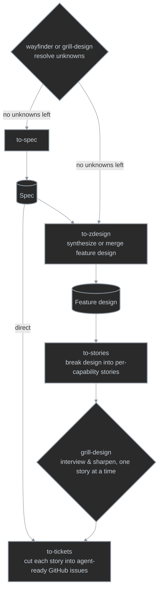

# wf plugin

Everyday workflow automation skills that carry a feature from an open-ended idea to agent-executable GitHub issues.

## Skill flow

1. **Discovery loop** — [`/wayfinder`](skills/wayfinder/SKILL.md) charts a map of decision tickets (grilled via `/grill-design`, investigated via `/research`, sanity-checked via `/prototype`) until the destination — a spec — is clear; `/to-spec` then synthesizes it.
2. **Requirements capture** — `/to-capabilities` independently turns an idea or spec into capability-aligned requirement sets when a standalone requirements artifact is needed.
3. **Design synthesis** — `/to-zdesign` combines resolved Wayfinder decisions and one or more specs into an authoritative feature design, reconciling capabilities and merging stronger evidence into an existing design.
4. **Story slicing** — `/to-stories` breaks the feature design down into one atomic story per capability.
5. **Story hardening** — `/grill-design` interviews and sharpens each story, run once per story.
6. **Ticket cut** — `/to-tickets` slices each hardened story into agent-executable GitHub issues.

