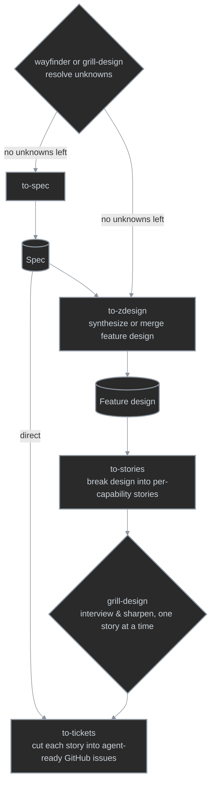

# wf plugin

Everyday workflow automation skills that carry a feature from an open-ended idea to agent-executable GitHub issues.

## Skill flow

1. **Discovery loop** — resolving unknowns before a spec or design is clear has two mechanics for the same purpose: [`/wayfinder`](skills/wayfinder/SKILL.md) charts a map of decision tickets on the issue tracker for work too big for one session, resolving each ticket via `/grill-design`, `/research`, or `/prototype`; `/grill-design` run directly interviews a smaller effort in one session, with no map or tickets. Either way, once no unknowns are left, the next step is `/to-spec` (or `/to-zdesign` directly).
2. **Spec synthesis** — `/to-spec` synthesizes the spec from the resolved Wayfinder decisions or grill-design conversation, the step right after the discovery loop; a spec can feed `/to-tickets` directly or go on into design synthesis.
3. **Design synthesis** — `/to-zdesign` combines resolved Wayfinder decisions and one or more specs into an authoritative feature design, reconciling capabilities and merging stronger evidence into an existing design.
4. **Story slicing** — `/to-stories` breaks the feature design down into one atomic story per capability.
5. **Story hardening** — `/grill-design` interviews and sharpens each story, run once per story.
6. **Ticket cut** — `/to-tickets` slices each hardened story into agent-executable GitHub issues.

