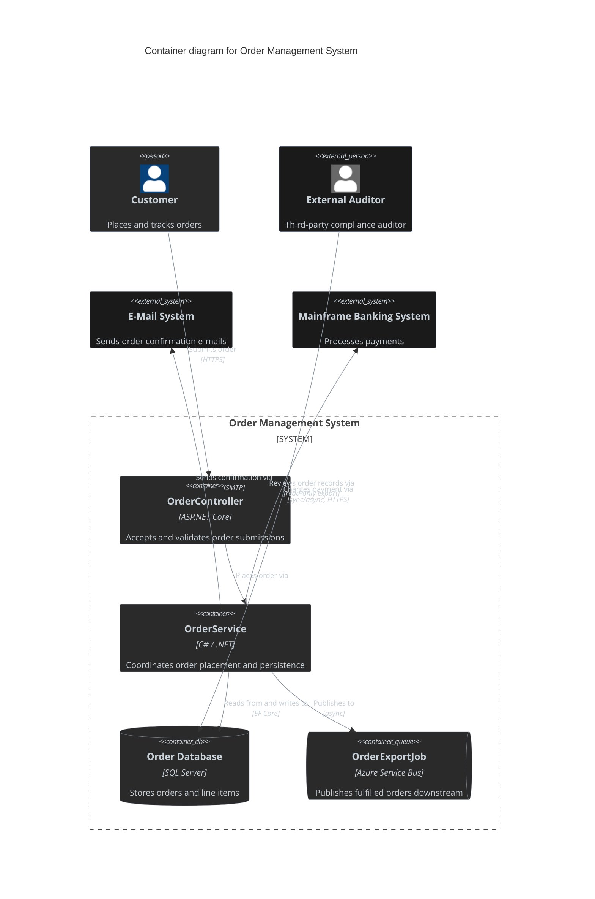
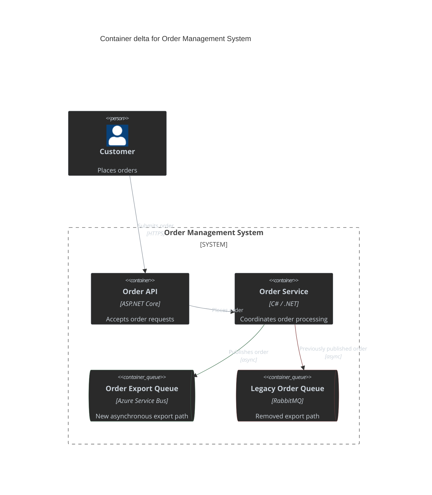
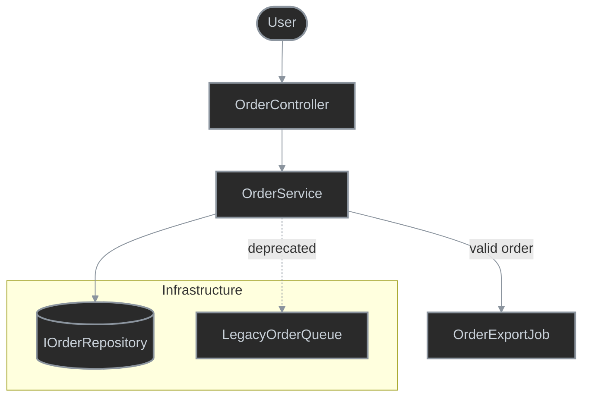
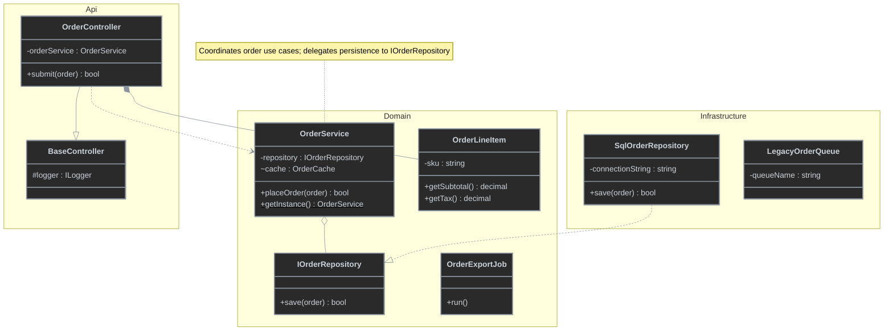
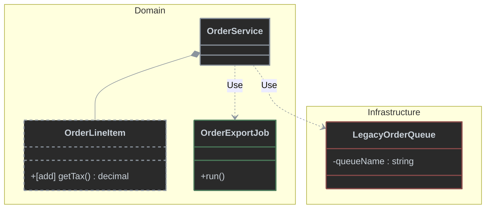
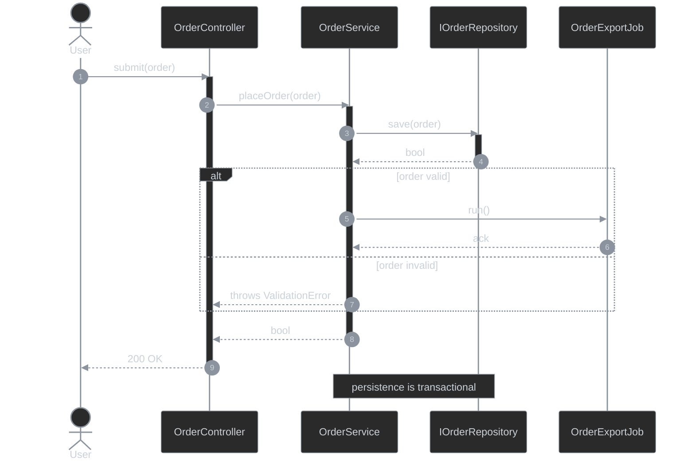
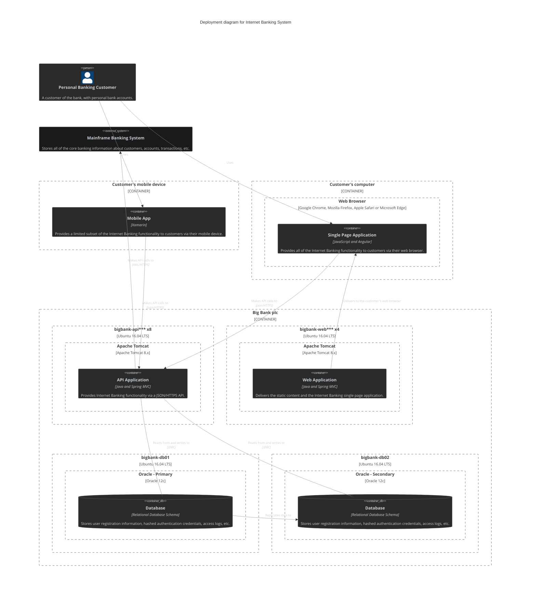

# To Diagram

Presentation examples for the `to-diagram` skill.

## Solution Diagram Example

<details>
<summary>Solution Diagram — Order Management System</summary>


</details>

## Container Diagram Delta Example

<details>
<summary>Order Management System — Container Delta</summary>


</details>

**Behaviour changes**
- `+` Order Export Queue replaces the legacy export path.
- `-` Legacy Order Queue is removed.
- `~` Order Service publishes exports through Azure Service Bus.

## Flowchart Example

<details>
<summary>Order Processing Flowchart</summary>


</details>

## Swimlane Diagram Example

<details>
<summary>Order Fulfillment Swimlane</summary>

```mermaid
%%{init: {'themeVariables': {'lineColor': '#8b949e'}}}%%
swimlane-beta TB
  subgraph frontend [Web Portal - GUI]
    submit[Customer clicks Place Order]
    showResult([Show confirmation / error])
  end

  subgraph restApi [Order Service - REST API]
    validate{Order valid and in stock?}
    placeOrder[OrderService.placeOrder]
    respond200[Respond 200 + order id]
    respond400[Respond 400 + error]
  end

  subgraph database [Order Database - Database]
    persistOrder[Persist order with state Placed]
  end

  submit -->|1. POST orders with order payload| validate
  validate -->|2a. No| respond400
  validate -->|2b. Yes| placeOrder
  respond400 -->|3a. 400 Bad Request| showResult
  placeOrder -->|3b. save order| persistOrder
  persistOrder -->|4b. order id| respond200
  respond200 -->|5b. 200 OK with order id| showResult

  classDef default fill:#242424,stroke:#8b949e,color:#c9d1d9,stroke-width:2px
```
</details>

## Class Diagram Example

<details>
<summary>Order Management Domain Classes</summary>


</details>

## Class Diagram Delta Example

<details>
<summary>Order Processing — Class Delta</summary>


</details>

## Sequence Diagram Example

<details>
<summary>Order Submission Sequence</summary>


</details>

## Deployment View Example

<details>
<summary>Internet Banking Deployment Topology</summary>


</details>
